# Advanced Architectures

*(Placeholder module — a short overview for now; full lesson content is coming soon.)*

Architectural patterns that go beyond the basic Observe-Decide-Act loop from Module 6.

**Topics this module will cover**:
- THREAD
- ReAct
- CodeAct
- RLM
- Dynamic Workflows

## Tutorial Progress

```mermaid
graph LR
    A[Advanced UI] --> B[Advanced Architectures]
    B --> C[Advanced Tools]
    C --> D[Advanced Memory]
    D --> E[Advanced Multi-Agent]
    E --> F[Advanced Prompting]
    F --> G[Adv. Context Eng.]
    G --> H[Adv. Harness Eng.]
    H --> I[Advanced Deployment]
    I --> J[Advanced Training]
    style A fill:#90EE90
    style B fill:#FFFF00
```

