# Advanced Coding Agents

*(Placeholder module: a short overview for now, full lesson content is coming soon.)*

The practices that go past the defaults, building on what Coding Agents: Extending Them set up.

**Topics this module will cover**:
- Claude Code best practices, and the CLI tools worth reaching for
- Rewind and resume: going back to an earlier point in a run rather than starting again
- Skills that a subagent runs from the command line
- Forking a session to try two directions from the same point

<!-- NEED: what "btw" refers to in the topic notes for this module. -->

## Tutorial Progress

```mermaid
graph LR
    A[Advanced Tools] --> B[Advanced Memory]
    B --> C[Advanced Multi-Agent]
    C --> D[Advanced Prompting]
    D --> E[Adv. Context Eng.]
    E --> F[Adv. Coding Agents]
    F --> G[Adv. Harness Eng.]
    G --> H[Adv. Agent Arch.]
    H --> I[Advanced UI]
    I --> J[Advanced Deployment]
    J --> K[Advanced Training]
    style A fill:#90EE90
    style B fill:#90EE90
    style C fill:#90EE90
    style D fill:#90EE90
    style E fill:#90EE90
    style F fill:#FFFF00
```

