# İleri Seviye Coding Agent'lar

*(Bu bir placeholder modül: şimdilik kısa bir özet, tam ders içeriği yakında geliyor.)*

Coding Agent'lar: Genişletme modülünün kurduğu şeyin üzerine, varsayılanların ötesine geçen
pratikler.

**Bu modülde işlenecek konular**:
- Claude Code best practice'leri, ve uzanmaya değer CLI tool'ları
- Rewind ve resume: baştan başlamak yerine çalışmanın daha erken bir noktasına dönmek
- Bir subagent'ın komut satırından çalıştırdığı skill'ler
- Aynı noktadan iki yönü denemek için bir oturumu fork'lamak

<!-- NEED: bu modülün konu notlarındaki "btw" neye işaret ediyor. -->

## Eğitim İlerlemesi

```mermaid
graph LR
    A[Advanced Tools] --> B[Advanced Memory]
    B --> C[Advanced Multi-Agent]
    C --> D[Advanced Prompting]
    D --> E[Adv. Context Eng.]
    E --> F[Adv. Coding Agents]
    F --> G[Adv. Harness Eng.]
    G --> H[Adv. Agent Arch.]
    H --> I[Advanced UI]
    I --> J[Advanced Deployment]
    J --> K[Advanced Training]
    style A fill:#90EE90
    style B fill:#90EE90
    style C fill:#90EE90
    style D fill:#90EE90
    style E fill:#90EE90
    style F fill:#FFFF00
```

