# Advanced Context Engineering

*(Placeholder module — a short overview for now; full lesson content is coming soon.)*

Frameworks and specs for structuring an agent's context and goals at a bigger scale than
[Context Engineering](../2_intermediate/context_engineering.md).

**Topics this module will cover**:
- Superpowers
- SpecKit
- GSD
- AgentOS
- Claude Native Plan / Goals / Ultrathink / Playground

## Tutorial Progress

```mermaid
graph LR
    A[Advanced UI] --> B[Advanced Architectures]
    B --> C[Advanced Tools]
    C --> D[Advanced Memory]
    D --> E[Advanced Multi-Agent]
    E --> F[Advanced Prompting]
    F --> G[Adv. Context Eng.]
    G --> H[Adv. Harness Eng.]
    H --> I[Advanced Deployment]
    I --> J[Advanced Training]
    style A fill:#90EE90
    style B fill:#90EE90
    style C fill:#90EE90
    style D fill:#90EE90
    style E fill:#90EE90
    style F fill:#90EE90
    style G fill:#FFFF00
```

