# İleri Seviye Deployment

*(Bu bir placeholder modül — şimdilik kısa bir özet; tam ders içeriği yakında geliyor.)*

Agent'ları tek seferlik script'ler veya chat oturumları olarak değil, gerçek production servisleri olarak çalıştırmak.

**Bu modülde işlenecek konular**:
- Agent server'lar
- LangChain Agent Protocol

## Eğitim İlerlemesi

```mermaid
graph LR
    A[Advanced UI] --> B[Advanced Architectures]
    B --> C[Advanced Tools]
    C --> D[Advanced Memory]
    D --> E[Advanced Multi-Agent]
    E --> F[Advanced Prompting]
    F --> G[Adv. Context Eng.]
    G --> H[Adv. Harness Eng.]
    H --> I[Advanced Deployment]
    I --> J[Advanced Training]
    style A fill:#90EE90
    style B fill:#90EE90
    style C fill:#90EE90
    style D fill:#90EE90
    style E fill:#90EE90
    style F fill:#90EE90
    style G fill:#90EE90
    style H fill:#90EE90
    style I fill:#FFFF00
```

