# Advanced Multi-Agent

*(Placeholder module — a short overview for now; full lesson content is coming soon.)*

Agent-to-Agent protocols and coordination patterns beyond the Manager-Worker setup from
Multi-Agent Systems.

**Topics this module will cover**:
- A2A
- Context delegation vs. subagent context delegation vs. messaging pool
- Shared context against isolated context, and what each costs
- Coordination failures, and how they are detected

**References to start from**:
- [Multi-agent systems](https://docs.langchain.com/oss/python/langchain/multi-agent): the patterns and the trade-offs, from the framework that names them
- [@langchain/langgraph-swarm](https://reference.langchain.com/javascript/langchain-langgraph-swarm): the JavaScript package for agents that hand off to each other directly, with a router that remembers which agent is currently active
- [@langchain/langgraph-supervisor](https://reference.langchain.com/javascript/langchain-langgraph-supervisor): the same idea in the Manager-Worker shape, with `createSupervisor()` and a hand-back message when a worker finishes
- [Workflows and agents](https://docs.langchain.com/oss/python/langgraph/workflows-agents): where a fixed workflow stops being enough and an agent has to decide the next step itself

## Tutorial Progress

```mermaid
graph LR
    A[Advanced UI] --> B[Advanced Architectures]
    B --> C[Advanced Tools]
    C --> D[Advanced Memory]
    D --> E[Advanced Multi-Agent]
    E --> F[Advanced Prompting]
    F --> G[Adv. Context Eng.]
    G --> H[Adv. Harness Eng.]
    H --> I[Advanced Deployment]
    I --> J[Advanced Training]
    style A fill:#90EE90
    style B fill:#90EE90
    style C fill:#90EE90
    style D fill:#90EE90
    style E fill:#FFFF00
```

