# İleri Seviye Multi-Agent

*(Bu bir placeholder modül — şimdilik kısa bir özet; tam ders içeriği yakında geliyor.)*

Multi-Agent Sistemler modülündeki Manager-Worker kurulumunun ötesinde Agent-to-Agent
protokolleri ve koordinasyon desenleri.

**Bu modülde işlenecek konular**:
- A2A
- Context delegation vs subagent context delegation vs messaging pool
- Paylaşılan context'e karşı izole context, ve her birinin maliyeti
- Koordinasyon hataları, ve nasıl tespit edildikleri

**Başlangıç için kaynaklar**:
- [Multi-agent sistemler](https://docs.langchain.com/oss/python/langchain/multi-agent): desenler ve ödünleşmeler, onlara adını veren framework'ten
- [@langchain/langgraph-swarm](https://reference.langchain.com/javascript/langchain-langgraph-swarm): agent'ların doğrudan birbirine devrettiği yapının JavaScript paketi, hangi agent'ın o anda aktif olduğunu hatırlayan bir router'la
- [@langchain/langgraph-supervisor](https://reference.langchain.com/javascript/langchain-langgraph-supervisor): aynı fikrin Manager-Worker şeklindeki hâli, `createSupervisor()` ve bir worker bitirdiğinde geri devretme mesajıyla
- [Workflows and agents](https://docs.langchain.com/oss/python/langgraph/workflows-agents): sabit bir workflow'un nerede yetmemeye başladığı, ve agent'ın sonraki adımı kendisinin seçmek zorunda kaldığı yer

## Eğitim İlerlemesi

```mermaid
graph LR
    A[Advanced Tools] --> B[Advanced Memory]
    B --> C[Advanced Multi-Agent]
    C --> D[Advanced Prompting]
    D --> E[Adv. Context Eng.]
    E --> F[Adv. Coding Agents]
    F --> G[Adv. Harness Eng.]
    G --> H[Adv. Agent Arch.]
    H --> I[Advanced UI]
    I --> J[Advanced Deployment]
    J --> K[Advanced Training]
    style A fill:#90EE90
    style B fill:#90EE90
    style C fill:#FFFF00
```

