# Advanced Tools

*(Placeholder module — a short overview for now; full lesson content is coming soon.)*

Deeper tool-design decisions that matter once an agent's toolset gets large or performance-sensitive.

**Topics this module will cover**:
- RAG vs. Agentic Search
- JSON vs. CLI tools
- Frontend Tools
- Code Mode

## Tutorial Progress

```mermaid
graph LR
    A[Advanced UI] --> B[Advanced Architectures]
    B --> C[Advanced Tools]
    C --> D[Advanced Memory]
    D --> E[Advanced Multi-Agent]
    E --> F[Advanced Prompting]
    F --> G[Adv. Context Eng.]
    G --> H[Adv. Harness Eng.]
    H --> I[Advanced Deployment]
    I --> J[Advanced Training]
    style A fill:#90EE90
    style B fill:#90EE90
    style C fill:#FFFF00
```

