# Advanced Training

*(Placeholder module: a short overview for now, full lesson content is coming soon.)*

What happens to a model after pre-training, and how a base model becomes something worth shipping.
Training LLMs covered pre-training, fine-tuning and PEFT at a high level. This one goes under
that.

**Topics this module will cover**:
- Self-supervised learning: how pre-training gets a training signal with no labels
- Post-training: everything done to a base model before it is released
- Reinforcement learning, and RLHF
- Preference alignment: DPO, PPO and GRPO
- Knowledge distillation: teaching a small model from a large one

**References to start from**:
- [Unsloth: reinforcement learning guide](https://unsloth.ai/docs/get-started/reinforcement-learning-rl-guide)
- [Unsloth: fine-tuning guide](https://unsloth.ai/docs/get-started/fine-tuning-llms-guide)
- [Unsloth documentation](https://unsloth.ai/docs)
- [Unsloth notebooks](https://unsloth.ai/docs/get-started/unsloth-notebooks)
- [Unsloth: is fine-tuning right for me?](https://unsloth.ai/docs/get-started/fine-tuning-for-beginners/faq-+-is-fine-tuning-right-for-me)

## Tutorial Progress

```mermaid
graph LR
    A[Advanced Tools] --> B[Advanced Memory]
    B --> C[Advanced Multi-Agent]
    C --> D[Advanced Prompting]
    D --> E[Adv. Context Eng.]
    E --> F[Adv. Coding Agents]
    F --> G[Adv. Harness Eng.]
    G --> H[Adv. Agent Arch.]
    H --> I[Advanced UI]
    I --> J[Advanced Deployment]
    J --> K[Advanced Training]
    style A fill:#90EE90
    style B fill:#90EE90
    style C fill:#90EE90
    style D fill:#90EE90
    style E fill:#90EE90
    style F fill:#90EE90
    style G fill:#90EE90
    style H fill:#90EE90
    style I fill:#90EE90
    style J fill:#90EE90
    style K fill:#FFFF00
```

