# İleri Seviye Training

*(Bu bir placeholder modül: şimdilik kısa bir özet, tam ders içeriği yakında geliyor.)*

Pre-training'den sonra modele ne olur, ve bir base model nasıl ürün haline gelir.
Training LLMs modülü pre-training, fine-tuning ve PEFT'i yüksek seviyede anlattı. Bu modül onun
altına iniyor.

**Bu modülde işlenecek konular**:
- Self-supervised learning: pre-training label olmadan training signal'i nasıl üretir
- Post-training: bir base model yayınlanmadan önce ona yapılan her şey
- Reinforcement learning ve RLHF
- Preference alignment: DPO, PPO ve GRPO
- Knowledge distillation: büyük bir modelden küçük bir modele öğretmek

**Başlangıç için kaynaklar**:
- [Unsloth: reinforcement learning guide](https://unsloth.ai/docs/get-started/reinforcement-learning-rl-guide)
- [Unsloth: fine-tuning guide](https://unsloth.ai/docs/get-started/fine-tuning-llms-guide)
- [Unsloth dokümantasyonu](https://unsloth.ai/docs)
- [Unsloth notebook'ları](https://unsloth.ai/docs/get-started/unsloth-notebooks)
- [Unsloth: fine-tuning bana uygun mu?](https://unsloth.ai/docs/get-started/fine-tuning-for-beginners/faq-+-is-fine-tuning-right-for-me)

## Eğitim İlerlemesi

```mermaid
graph LR
    A[Advanced Tools] --> B[Advanced Memory]
    B --> C[Advanced Multi-Agent]
    C --> D[Advanced Prompting]
    D --> E[Adv. Context Eng.]
    E --> F[Adv. Coding Agents]
    F --> G[Adv. Harness Eng.]
    G --> H[Adv. Agent Arch.]
    H --> I[Advanced UI]
    I --> J[Advanced Deployment]
    J --> K[Advanced Training]
    style A fill:#90EE90
    style B fill:#90EE90
    style C fill:#90EE90
    style D fill:#90EE90
    style E fill:#90EE90
    style F fill:#90EE90
    style G fill:#90EE90
    style H fill:#90EE90
    style I fill:#90EE90
    style J fill:#90EE90
    style K fill:#FFFF00
```

