# Advanced UI

*(Placeholder module — a short overview for now; full lesson content is coming soon.)*

UI that agents can drive or generate live, and the emerging protocols connecting agents to interfaces.

**Topics this module will cover**:
- Agentic UI
- Generative UI
- Event streaming
- AG-UI
- MCP-Apps UI
- A2UI
- CopilotKit
- Agent Client Protocol (ACP)

## Tutorial Progress

```mermaid
graph LR
    A[Advanced UI] --> B[Advanced Architectures]
    B --> C[Advanced Tools]
    C --> D[Advanced Memory]
    D --> E[Advanced Multi-Agent]
    E --> F[Advanced Prompting]
    F --> G[Adv. Context Eng.]
    G --> H[Adv. Harness Eng.]
    H --> I[Advanced Deployment]
    I --> J[Advanced Training]
    style A fill:#FFFF00
```

