# Advanced UI

*(Placeholder module — a short overview for now; full lesson content is coming soon.)*

UI that agents can drive or generate live, and the emerging protocols connecting agents to interfaces.

**Topics this module will cover**:
- Agentic UI
- Generative UI
- Event streaming
- AG-UI
- MCP-Apps UI
- A2UI
- CopilotKit
- Agent Client Protocol (ACP)

**References to start from**:
- [What is agentic UI?](https://www.copilotkit.ai/learning/what-is-agentic-ui): the concept on its own, before any framework
- [Generative UI](https://www.copilotkit.ai/generative-ui): the same again for an interface the model produces rather than drives
- [A2UI: get started in 5 minutes](https://a2ui.org/#get-started-in-5-minutes) and [how agents work](https://a2ui.org/reference/agents/#how-agents-work): the protocol, from the shortest way in to the agent side of it
- [AGenUI](https://github.com/AGenUI/AGenUI): a native A2UI renderer for iOS, Android and HarmonyOS, so the protocol reaches a phone instead of a browser
- [AG-UI: state](https://docs.ag-ui.com/concepts/state): how the agent's state and the front end stay in step
- [CopilotKit: agent-app context](https://docs.copilotkit.ai/agent-app-context), [shared state](https://docs.copilotkit.ai/shared-state) and [frontend tools](https://docs.copilotkit.ai/frontend-tools): the three pieces that let an agent read the app it lives inside and act on it
- [OpenGenerativeUI](https://github.com/CopilotKit/OpenGenerativeUI): CopilotKit's open-source generative UI framework
- [json-render](https://github.com/vercel-labs/json-render): Vercel Labs' generative UI framework
- [OpenUI](https://www.openui.com/): a renderer-agnostic open standard for generative UI, streaming first, claiming far fewer tokens than sending JSON
- [LangChain: headless tools](https://docs.langchain.com/oss/python/langchain/frontend/headless-tools): the same idea from the framework side, tools with no interface of their own

## Tutorial Progress

```mermaid
graph LR
    A[Advanced UI] --> B[Advanced Architectures]
    B --> C[Advanced Tools]
    C --> D[Advanced Memory]
    D --> E[Advanced Multi-Agent]
    E --> F[Advanced Prompting]
    F --> G[Adv. Context Eng.]
    G --> H[Adv. Harness Eng.]
    H --> I[Advanced Deployment]
    I --> J[Advanced Training]
    style A fill:#FFFF00
```

