# İleri Seviye UI

*(Bu bir placeholder modül — şimdilik kısa bir özet; tam ders içeriği yakında geliyor.)*

Agent'ların canlı olarak yönlendirebildiği veya oluşturabildiği arayüzler, ve agent'ları arayüzlere bağlayan ortaya çıkan protokoller.

**Bu modülde işlenecek konular**:
- Agentic UI
- Generative UI
- Event streaming
- AG-UI
- MCP-Apps UI
- A2UI
- CopilotKit
- Agent Client Protocol (ACP)

**Başlangıç için kaynaklar**:
- [Agentic UI nedir?](https://www.copilotkit.ai/learning/what-is-agentic-ui): herhangi bir framework'ten önce kavramın kendisi
- [Generative UI](https://www.copilotkit.ai/generative-ui): aynısı, ama modelin yönlendirdiği değil ürettiği bir arayüz için
- [A2UI: 5 dakikada başlangıç](https://a2ui.org/#get-started-in-5-minutes) ve [agent'lar nasıl çalışıyor](https://a2ui.org/reference/agents/#how-agents-work): protokolün kendisi, en kısa giriş yolundan agent tarafına
- [AGenUI](https://github.com/AGenUI/AGenUI): iOS, Android ve HarmonyOS için native bir A2UI renderer'ı, yani protokol tarayıcı yerine telefona ulaşıyor
- [AG-UI: state](https://docs.ag-ui.com/concepts/state): agent'ın state'i ile ön yüzün nasıl aynı hizada kaldığı
- [CopilotKit: agent-app context](https://docs.copilotkit.ai/agent-app-context), [shared state](https://docs.copilotkit.ai/shared-state) ve [frontend tools](https://docs.copilotkit.ai/frontend-tools): bir agent'ın içinde yaşadığı uygulamayı okuyup üzerinde iş yapmasını sağlayan üç parça
- [OpenGenerativeUI](https://github.com/CopilotKit/OpenGenerativeUI): CopilotKit'in açık kaynak generative UI framework'ü
- [json-render](https://github.com/vercel-labs/json-render): Vercel Labs'ın generative UI framework'ü
- [OpenUI](https://www.openui.com/): generative UI için renderer'dan bağımsız açık bir standart, streaming öncelikli, JSON göndermekten çok daha az token iddiasıyla
- [LangChain: headless tool'lar](https://docs.langchain.com/oss/python/langchain/frontend/headless-tools): aynı fikir framework tarafından, kendi arayüzü olmayan tool'lar

## Eğitim İlerlemesi

```mermaid
graph LR
    A[Advanced UI] --> B[Advanced Architectures]
    B --> C[Advanced Tools]
    C --> D[Advanced Memory]
    D --> E[Advanced Multi-Agent]
    E --> F[Advanced Prompting]
    F --> G[Adv. Context Eng.]
    G --> H[Adv. Harness Eng.]
    H --> I[Advanced Deployment]
    I --> J[Advanced Training]
    style A fill:#FFFF00
```

