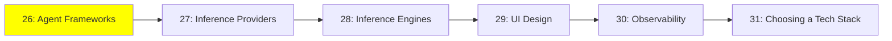

# Module 25: Agent Frameworks

*Category: Ecosystem — Module 25 (1 of 6 in this category)*

*(Placeholder module — a short overview for now; full lesson content is coming soon.)*

A tour of the frameworks people actually use to build agents, and how they differ.

**Topics this module will cover**:
- LangChain
- Agno
- CrewAI
- smolagents
- Mastra
- VoltAgent
- PydanticAI

## Tutorial Progress

**Previous Module:** [Expert, Module 24: Advanced Training](../3_expert/24_advanced_training.md)
**Next Module:** [Module 26: Inference Providers](26_inference_providers.md)
