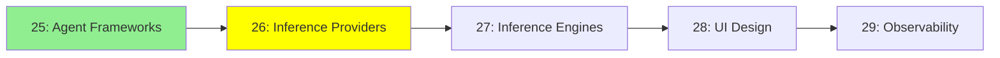

# Module 26: Inference Providers

*Category: Ecosystem — Module 26 (2 of 5 in this category)*

*(Placeholder module — a short overview for now; full lesson content is coming soon.)*

Hosted APIs that serve LLM inference, so you don't have to run any hardware yourself.

**Topics this module will cover**:
- OpenRouter
- OpenAI
- Google AI Studio

## Tutorial Progress

**Previous Module:** [Module 25: Agent Frameworks](25_agent_frameworks.md)
**Next Module:** [Module 27: Inference Engines](27_inference_engines.md)
