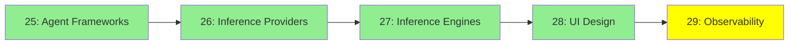

# Module 29: Observability

*Category: Ecosystem — Module 29 (5 of 5 in this category)*

*(Placeholder module — a short overview for now; full lesson content is coming soon.)*

Watching what your agents actually do — every prompt, tool call, and decision along the way.

**Topics this module will cover**:
- LangSmith
- LangFuse
- Trace-analyzer agents

## Tutorial Progress

**Previous Module:** [Module 28: UI Design](28_ui_design.md)
**Next Module:** [Protocols & Specs — Module 30: Protocols Reference](../5_protocols_specs/30_protocols_reference.md)
