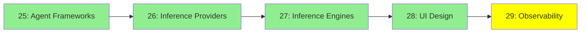

# Module 29: Observability (Gözlemlenebilirlik)

*Kategori: Ecosystem — Modül 29 (bu kategoride 5/5)*

*(Bu bir placeholder modül — şimdilik kısa bir özet; tam ders içeriği yakında geliyor.)*

Agent'larının gerçekte ne yaptığını izlemek—yol boyunca her prompt, tool çağrısı ve karar.

**Bu modülde işlenecek konular**:
- LangSmith
- LangFuse
- Trace-analyzer agent'lar

## Eğitim İlerlemesi

**Önceki Modül:** [Modül 28: UI Tasarımı](28_ui_design_tr.md)
**Sonraki Modül:** [Protocols & Specs — Modül 30: Protokol Referansı](../5_protocols_specs/30_protocols_reference_tr.md)
