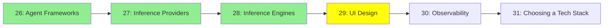

# Module 29: UI Tasarımı

*Kategori: Ecosystem — Modül 29 (bu kategoride 4/6)*

*(Bu bir placeholder modül — şimdilik kısa bir özet; tam ders içeriği yakında geliyor.)*

Agent'a yönelik veya agent tarafından inşa edilen arayüzleri tasarlama araçları ve pratikleri.

**Bu modülde işlenecek konular**:
- Stitch
- Claude'un tasarım araçları
- Design System'ler
- DESIGN.md

## Eğitim İlerlemesi

**Önceki Modül:** [Modül 28: Inference Motorları](28_inference_engines_tr.md)
**Sonraki Modül:** [Modül 30: Observability (Gözlemlenebilirlik)](30_observability_tr.md)
