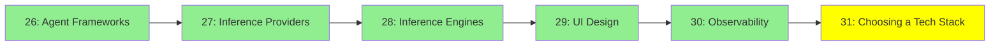

# Module 30: Tech Stack Seçimi

*Kategori: Ecosystem, Modül 30 (bu kategoride 6/6)*

*(Bu bir placeholder modül: şimdilik kısa bir özet, tam ders içeriği yakında geliyor.)*

Bundan önceki Ecosystem modülleri seçenekleri sıralıyor: agent framework'leri, inference
provider'lar, inference engine'ler, UI araçları ve observability. Bu modül ise gerçek bir proje
için bunlar arasından seçim yapmakla ilgili, ki bu neyin var olduğunu bilmekten farklı bir
beceri.

## Eğitim İlerlemesi

**Önceki Modül:** [Modül 29: Observability](29_observability_tr.md)
**Sonraki Modül:** [Protocols & Specs, Modül 31: Protocols Reference](../5_protocols_specs/31_protocols_reference_tr.md)
