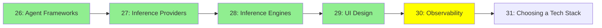

# Module 30: Observability

*Category: Ecosystem — Module 30 (5 of 6 in this category)*

*(Placeholder module — a short overview for now; full lesson content is coming soon.)*

Watching what your agents actually do — every prompt, tool call, and decision along the way.

**Topics this module will cover**:
- LangSmith
- LangFuse
- Trace-analyzer agents

## Tutorial Progress

**Previous Module:** [Module 29: UI Design](29_ui_design.md)
**Next Module:** [Module 31: Choosing a Tech Stack](31_choosing_tech_stack.md)
