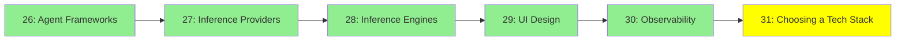

# Module 31: Choosing a Tech Stack

*Category: Ecosystem, Module 31 (6 of 6 in this category)*

*(Placeholder module: a short overview for now, full lesson content is coming soon.)*

The Ecosystem modules before this one lay out the options: agent frameworks, inference
providers, inference engines, UI tooling and observability. This one is about picking from them
for a real project, which is a different skill from knowing what exists.

<!-- NEED: the topic list for this module. The obvious spine is how to choose between the
     options laid out in modules 26 to 30, but the criteria worth teaching are the author's
     call. -->

## Tutorial Progress

**Previous Module:** [Module 30: Observability](30_observability.md)
**Next Module:** [Protocols & Specs, Module 32: Protocols Reference](../5_protocols_specs/32_protocols_reference.md)
