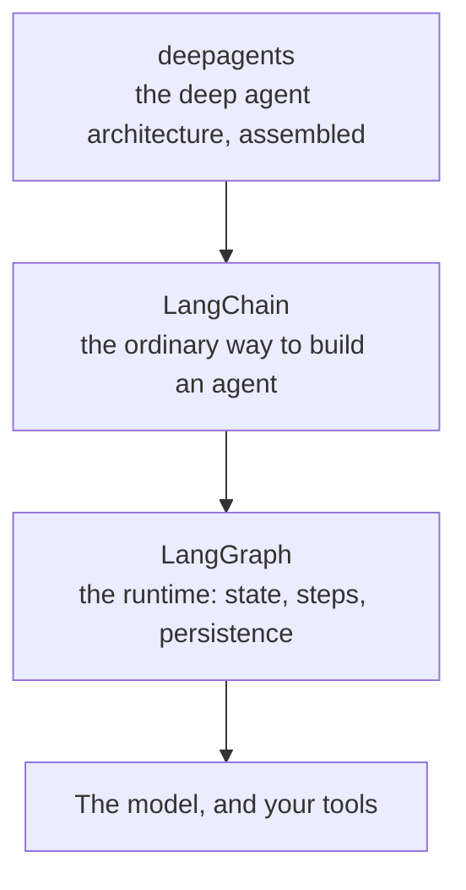
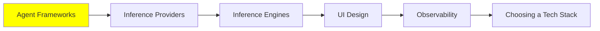

# Agent Frameworks

Everything up to here has been about how agents work. This module is about what you actually install to build one.

The honest starting point: you do not need a framework. [AI Agents](../1_fundamentals/agents.md) showed the loop, and it is a `while` loop around a model call with a tool dispatch in the middle. You can write that in an afternoon.

What you get from a framework is everything around the loop. Retries when a provider returns a 500. Streaming so the user sees tokens as they arrive. A standard tool schema so you do not hand-write JSON for every function. Memory that survives a restart. Somewhere to put the traces. That list is why most people stop writing their own after the second project.

## The LangChain stack, which is three things

This is the one to learn first. It is the most complete, the most current, and the one most likely to be running in production somewhere near you. It also confuses people, because "LangChain" is three separate libraries at three levels, and which one you want depends on the job.

**[LangGraph](https://github.com/langchain-ai/langgraph)** is the runtime, and the lowest level of the three. You describe your agent as a graph: nodes are steps, edges are what can happen next, and the state travels between them. Because the state is explicit, the runtime can save it, resume from it, and let a human interrupt mid-run. Reach for LangGraph when the control flow is the hard part and you want to own it.

**[LangChain](https://github.com/langchain-ai/langchain)** is the main interface, and where you should start. It sits on top of LangGraph and gives you the ordinary agent in a few lines: a model, some tools, some middleware. The middleware is where the [Harness Engineering](../2_intermediate/harness_engineering.md) work happens, and it is also where the guardrails from [Security](../2_intermediate/security.md) live.

**[deepagents](https://github.com/langchain-ai/deepagents)** is the highest level, built on the other two. It calls itself a batteries-included agent harness, and the batteries are exactly the list from [Context Engineering](../2_intermediate/context_engineering.md): planning, a filesystem, subagents with their own windows, and summarisation of long threads. If what you want is the deep agent architecture rather than a bespoke one, start here and skip the assembly.

So the rule of thumb is simple. Start at LangChain. Drop down to LangGraph when you need to control the flow yourself. Go up to deepagents when you want the whole architecture handed to you.

## The other Python options

None of these is wrong. They make different trade-offs, and the trade-off is usually how much they decide for you.

- **[Agno](https://github.com/agno-agi/agno)** aims past the single agent at the whole platform: building, running and managing agents as a system rather than a script.
- **[CrewAI](https://github.com/crewAIInc/crewAI)** organises everything around roles. You describe a crew of agents with jobs and let them collaborate, which maps neatly onto the multi-agent shapes from [Multi-Agent Systems](../1_fundamentals/multi_agent.md).
- **[smolagents](https://github.com/huggingface/smolagents)** from Hugging Face is the small one, and deliberately so: a barebones library for agents that think in code. It is the CodeAct idea from [Loop Engineering](../2_intermediate/loop_engineering.md) as a library, and the best one to read if you want to understand a loop rather than use one.
- **[Pydantic AI](https://github.com/pydantic/pydantic-ai)** brings the thing Pydantic is good at, which is types. Every model and every interface, typed end to end, so a malformed tool call is a validation error rather than a mystery.

## If your project is TypeScript

Two worth knowing, because the whole stack above is Python-first and most product code is not.

- **[Mastra](https://github.com/mastra-ai/mastra)** is the modern TypeScript framework for agents and AI applications, and the closest thing to a LangChain equivalent in that language.
- **[VoltAgent](https://github.com/VoltAgent/voltagent)** is an agent engineering platform on top of an open-source TypeScript framework, so it leans further towards the operational side.

## When you want a workflow instead of an agent

Here is a distinction worth getting right, because choosing wrong costs you months.

An **AI workflow** runs a path somebody wrote down. The steps are fixed, code decides what happens next, and the model is called at particular points to do particular jobs. An **AI agent** decides for itself: it picks the tools and the order, and the path is different every run. The [Prompt Engineering Guide's comparison](https://www.promptingguide.ai/agents/ai-workflows-vs-ai-agents) puts it as hard-coded logic against LLM-driven reasoning.

The mistake is assuming the agent is the grown-up version. It is not. If the requirements are stable and you know the steps, a workflow is more predictable, cheaper and easier to debug, and predictable is usually what production wants. Save the agent for open-ended work where nobody can write the steps down in advance.

**[n8n](https://github.com/n8n-io/n8n)** is the tool most people end up using for the workflow half. You build on a visual canvas, wire in 400-plus integrations, drop in custom code where you need it, and self-host or use their cloud. For "when a form is submitted, classify it, look something up, write to the database, send a message", this beats an agent comfortably.

And it closes a loop with [Coding Agents: Extending Them](../2_intermediate/coding_agents.md). n8n runs an MCP server, so your coding agent can connect to your n8n instance and **build the workflow for you**: you describe what you want in plain language, and it assembles the nodes, validates the result, runs it and fixes what broke. Building workflows through MCP arrived in v2.13. So the agent and the workflow stop being alternatives, and the agent becomes the thing that writes the workflow.

## And if you are not going to write code at all

Worth saying plainly, because engineers tend to skip it: for a lot of jobs the right answer is a no-code platform. **Lovable** and **Bolt** turn a description into a working application, deploy it, and let you keep prompting to change it. For a prototype, an internal tool, or a landing page with a form behind it, that is hours instead of weeks.

The trade is the usual one. You get speed now and less control later, and moving off the platform means rebuilding. Know which of those you are buying.

## Where this fits in the series

## Summary

A framework does not give you the agent loop, which you could write yourself. It gives you everything around the loop: retries, streaming, tool schemas, memory that survives a restart, and somewhere for the traces to go.

LangChain is three libraries at three levels. LangGraph is the runtime, where the state is explicit so a run can be saved, resumed and interrupted. LangChain is the ordinary interface and the place to start. deepagents is the deep agent architecture already assembled. Start in the middle and move up or down as the job demands.

Agno, CrewAI, smolagents and Pydantic AI are the other Python options, and they differ mostly in how much they decide for you. Mastra and VoltAgent are the TypeScript answers.

Then the distinction that matters most: a workflow runs a path you wrote, an agent decides its own. The agent is not the upgrade. If you can write the steps down, write them down, and n8n is where that lives. Its MCP server means your coding agent can build those workflows for you, which makes the two approaches partners rather than rivals.

**Quick Check**: you can describe every step of the job in advance. Should you build an agent, and why not?

## References

- [LangChain](https://github.com/langchain-ai/langchain): the main interface, and the place to start
- [LangGraph](https://github.com/langchain-ai/langgraph): the runtime underneath, for when you want to own the control flow
- [deepagents](https://github.com/langchain-ai/deepagents): the deep agent architecture, already put together
- [Agno](https://github.com/agno-agi/agno): agents as a managed platform rather than a script
- [CrewAI](https://github.com/crewAIInc/crewAI): agents organised as roles in a crew
- [smolagents](https://github.com/huggingface/smolagents): the barebones one, and the best to read
- [Pydantic AI](https://github.com/pydantic/pydantic-ai): typed end to end, so bad tool calls fail loudly
- [Mastra](https://github.com/mastra-ai/mastra) and [VoltAgent](https://github.com/VoltAgent/voltagent): the TypeScript options
- [AI Workflows vs AI Agents](https://www.promptingguide.ai/agents/ai-workflows-vs-ai-agents): the distinction, and when each one is right
- [n8n](https://github.com/n8n-io/n8n): the workflow platform, with [an MCP server that builds the workflows for you](https://docs.n8n.io/advanced-ai/mcp/accessing-n8n-mcp-server/)
