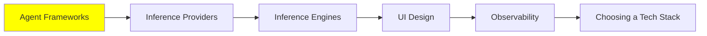

# Agent Frameworks

*(Placeholder module — a short overview for now; full lesson content is coming soon.)*

A tour of the frameworks people actually use to build agents, and how they differ.

**Topics this module will cover**:
- LangChain
- Agno
- CrewAI
- smolagents
- Mastra
- VoltAgent
- PydanticAI

## Tutorial Progress

