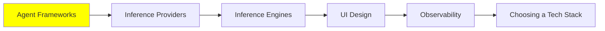

# Agent Framework'leri

*(Bu bir placeholder modül — şimdilik kısa bir özet; tam ders içeriği yakında geliyor.)*

İnsanların agent inşa etmek için gerçekten kullandığı framework'lerin bir turu, ve birbirlerinden farkları.

**Bu modülde işlenecek konular**:
- LangChain
- Agno
- CrewAI
- smolagents
- Mastra
- VoltAgent
- PydanticAI

## Eğitim İlerlemesi

