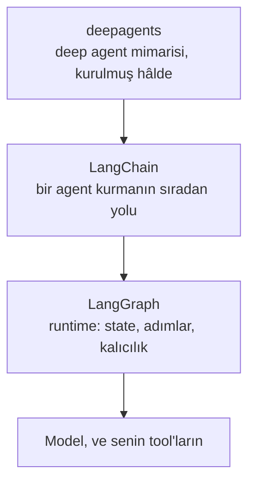
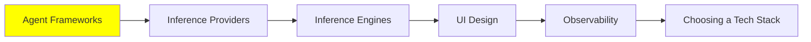

# Agent Framework'leri

Buraya kadar her şey agent'ların nasıl çalıştığıyla ilgiliydi. Bu modül, bir tane kurmak için gerçekte ne kurduğunla ilgili.

Dürüst başlangıç noktası: bir framework'e ihtiyacın yok. [AI Agent'lar](../1_fundamentals/agents_tr.md) loop'u göstermişti, ve o loop, ortasında bir tool dağıtımı olan, bir model çağrısı etrafındaki bir `while` döngüsü. Bunu bir öğleden sonrada yazabilirsin.

Framework'ten aldığın şey, loop'un etrafındaki her şey. Bir sağlayıcı 500 döndürdüğünde retry. Kullanıcının token'ları geldikçe görmesi için streaming. Her fonksiyon için elle JSON yazmayasın diye standart bir tool schema'sı. Bir restart'tan sağ çıkan memory. Trace'leri koyacak bir yer. Bu liste, insanların çoğunun ikinci projeden sonra kendi loop'unu yazmayı bırakmasının sebebi.

## LangChain stack'i, ki üç şey

İlk öğrenilecek olan bu. En eksiksiz olanı, en güncel olanı, ve yakınında bir yerde production'da çalışması en muhtemel olanı. Ayrıca insanların kafasını karıştırıyor, çünkü "LangChain" üç farklı seviyede üç ayrı kütüphane, ve hangisini istediğin işe bağlı.

**[LangGraph](https://github.com/langchain-ai/langgraph)** runtime, ve üçünün en alt seviyesi. Agent'ını bir graph olarak tanımlıyorsun: node'lar adımlar, edge'ler sırada ne olabileceği, ve state aralarında dolaşıyor. State açık olduğu için runtime onu kaydedebiliyor, oradan devam edebiliyor, ve bir insanın ortada araya girmesine izin verebiliyor. Kontrol akışı işin zor kısmıysa ve ona sahip olmak istiyorsan LangGraph'a uzan.

**[LangChain](https://github.com/langchain-ai/langchain)** ana arayüz, ve başlaman gereken yer. LangGraph'ın üstünde duruyor ve sana sıradan agent'ı birkaç satırda veriyor: bir model, birkaç tool, biraz middleware. Middleware, [Harness Engineering](../2_intermediate/harness_engineering_tr.md) işinin olduğu yer, ve aynı zamanda [Security](../2_intermediate/security_tr.md)'deki guardrail'lerin yaşadığı yer.

**[deepagents](https://github.com/langchain-ai/deepagents)** en üst seviye, diğer ikisinin üstüne kurulu. Kendisine batteries-included bir agent harness diyor, ve bataryalar da tam olarak [Context Engineering](../2_intermediate/context_engineering_tr.md)'deki liste: planlama, bir filesystem, kendi window'ları olan subagent'lar, ve uzun thread'lerin özetlenmesi. İstediğin şey kendine özel bir mimari değil deep agent mimarisiyse, buradan başla ve montajı atla.

Yani pratik kural basit. LangChain'den başla. Akışı kendin kontrol etmen gerektiğinde LangGraph'a in. Bütün mimarinin sana verilmesini istediğinde deepagents'a çık.

## Diğer Python seçenekleri

Bunların hiçbiri yanlış değil. Farklı ödünler veriyorlar, ve ödün genelde senin yerine ne kadarına karar verdikleri.

- **[Agno](https://github.com/agno-agi/agno)** tek agent'ın ötesine, bütün platforma bakıyor: agent'ları bir script yerine bir sistem olarak kurmak, çalıştırmak ve yönetmek.
- **[CrewAI](https://github.com/crewAIInc/crewAI)** her şeyi roller etrafında düzenliyor. İşleri olan bir agent ekibi tanımlıyorsun ve iş birliği yapmalarına izin veriyorsun, ki bu da [Multi-Agent Sistemler](../1_fundamentals/multi_agent_tr.md)'deki şekillere düzgün oturuyor.
- **Hugging Face'in [smolagents](https://github.com/huggingface/smolagents)** kütüphanesi küçük olanı, ve bilerek öyle: kodla düşünen agent'lar için asgari bir kütüphane. [Loop Engineering](../2_intermediate/loop_engineering_tr.md)'deki CodeAct fikrinin kütüphane hâli, ve bir loop'u kullanmak değil anlamak istiyorsan okunacak en iyisi.
- **[Pydantic AI](https://github.com/pydantic/pydantic-ai)** Pydantic'in iyi olduğu şeyi getiriyor, yani tip'leri. Her model ve her arayüz baştan sona tipli, böylece bozuk bir tool çağrısı bir gizem değil bir validation hatası oluyor.

## Projen TypeScript ise

Bilinmeye değer iki tane, çünkü yukarıdaki bütün stack Python öncelikli ve ürün kodunun çoğu değil.

- **[Mastra](https://github.com/mastra-ai/mastra)** agent'lar ve AI uygulamaları için modern TypeScript framework'ü, ve o dildeki LangChain karşılığına en yakın şey.
- **[VoltAgent](https://github.com/VoltAgent/voltagent)** açık kaynak bir TypeScript framework'ünün üstünde bir agent engineering platformu, yani operasyon tarafına daha çok yaslanıyor.

## Agent yerine workflow istediğinde

Doğru anlamaya değen bir ayrım var, çünkü yanlış seçmek sana aylara mal oluyor.

Bir **AI workflow**, birinin yazdığı bir yolu çalıştırıyor. Adımlar sabit, sırada ne olacağına kod karar veriyor, ve model belirli noktalarda belirli işleri yapmak için çağrılıyor. Bir **AI agent** kendisi karar veriyor: tool'ları ve sırayı kendi seçiyor, ve yol her çalışmada farklı. [Prompt Engineering Guide'ın karşılaştırması](https://www.promptingguide.ai/agents/ai-workflows-vs-ai-agents) bunu hard-coded mantığa karşı LLM'in yürüttüğü akıl yürütme diye koyuyor.

Hata, agent'ın yetişkin versiyon olduğunu varsaymak. Değil. Gereksinimler durağansa ve adımları biliyorsan, bir workflow daha öngörülebilir, daha ucuz ve debug'ı daha kolay; ve öngörülebilir genelde production'ın istediği şey. Agent'ı, adımları kimsenin önceden yazamadığı açık uçlu işlere sakla.

**[n8n](https://github.com/n8n-io/n8n)** insanların workflow yarısı için en çok kullandığı tool. Görsel bir kanvasta kuruyorsun, 400'den fazla entegrasyonu bağlıyorsun, ihtiyaç duyduğun yere kendi kodunu koyuyorsun, ve kendin barındırıyorsun ya da onların bulutunu kullanıyorsun. "Bir form gönderildiğinde sınıflandır, bir şeye bak, veritabanına yaz, bir mesaj gönder" için bu bir agent'ı rahatça yeniyor.

Ve [Coding Agent'lar: Genişletme](../2_intermediate/coding_agents_tr.md) ile bir halka kapatıyor. n8n bir MCP server çalıştırıyor, yani coding agent'ın senin n8n instance'ına bağlanıp **workflow'u senin için kurabiliyor**: ne istediğini düz dille anlatıyorsun, o da node'ları birleştiriyor, sonucu doğruluyor, çalıştırıyor ve bozulanı düzeltiyor. MCP üzerinden workflow kurmak v2.13'te geldi. Yani agent ve workflow alternatif olmaktan çıkıyor, ve agent workflow'u yazan şey oluyor.

## Ve hiç kod yazmayacaksan

Düpedüz söylemeye değer, çünkü mühendisler bunu atlama eğiliminde: bir sürü iş için doğru cevap bir no-code platform. **Lovable** ve **Bolt** bir açıklamayı çalışan bir uygulamaya çeviriyor, deploy ediyor, ve değiştirmek için prompt'lamaya devam etmene izin veriyor. Bir prototip, bir iç tool, ya da arkasında form olan bir landing page için bu, haftalar yerine saatler.

Ödün alışılmış olanı. Şimdi hız alıyorsun, sonra daha az kontrol, ve platformdan çıkmak yeniden kurmak demek. Hangisini satın aldığını bil.

## Bu serinin neresindeyiz

## Özet

Bir framework sana agent loop'unu vermiyor, ki onu kendin yazabilirsin. Loop'un etrafındaki her şeyi veriyor: retry'lar, streaming, tool schema'ları, bir restart'tan sağ çıkan memory, ve trace'lerin gideceği bir yer.

LangChain üç seviyede üç kütüphane. LangGraph runtime, state'in açık olduğu ve bir çalışmanın kaydedilip devam ettirilip kesilebildiği yer. LangChain sıradan arayüz ve başlanacak yer. deepagents ise zaten kurulmuş deep agent mimarisi. Ortadan başla, ve iş gerektirdikçe yukarı ya da aşağı git.

Agno, CrewAI, smolagents ve Pydantic AI diğer Python seçenekleri, ve çoğunlukla senin yerine ne kadarına karar verdiklerinde farklılaşıyorlar. Mastra ve VoltAgent da TypeScript cevapları.

Sonra en çok önemli olan ayrım: bir workflow senin yazdığın yolu çalıştırıyor, bir agent kendi yolunu seçiyor. Agent bir yükseltme değil. Adımları yazabiliyorsan yaz, ve n8n de onun yaşadığı yer. MCP server'ı sayesinde coding agent'ın o workflow'ları senin için kurabiliyor, ki bu da iki yaklaşımı rakip değil ortak yapıyor.

**Hızlı Kontrol**: işin her adımını önceden anlatabiliyorsun. Bir agent kurmalı mısın, ve neden hayır?

## Kaynaklar

- [LangChain](https://github.com/langchain-ai/langchain): ana arayüz, ve başlanacak yer
- [LangGraph](https://github.com/langchain-ai/langgraph): alttaki runtime, kontrol akışına sahip olmak istediğinde
- [deepagents](https://github.com/langchain-ai/deepagents): deep agent mimarisi, zaten bir araya getirilmiş
- [Agno](https://github.com/agno-agi/agno): script yerine yönetilen bir platform olarak agent'lar
- [CrewAI](https://github.com/crewAIInc/crewAI): bir ekipte roller olarak düzenlenmiş agent'lar
- [smolagents](https://github.com/huggingface/smolagents): asgari olanı, ve okunacak en iyisi
- [Pydantic AI](https://github.com/pydantic/pydantic-ai): baştan sona tipli, böylece bozuk tool çağrıları yüksek sesle patlıyor
- [Mastra](https://github.com/mastra-ai/mastra) ve [VoltAgent](https://github.com/VoltAgent/voltagent): TypeScript seçenekleri
- [AI Workflows vs AI Agents](https://www.promptingguide.ai/agents/ai-workflows-vs-ai-agents): ayrım, ve hangisinin ne zaman doğru olduğu
- [n8n](https://github.com/n8n-io/n8n): workflow platformu, ve [workflow'ları senin için kuran bir MCP server](https://docs.n8n.io/advanced-ai/mcp/accessing-n8n-mcp-server/) ile
