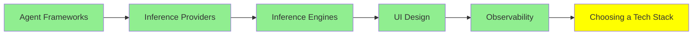

# Tech Stack Seçimi

*(Bu bir placeholder modül: şimdilik kısa bir özet, tam ders içeriği yakında geliyor.)*

Bundan önceki Ecosystem modülleri seçenekleri sıralıyor: agent framework'leri, inference
provider'lar, inference engine'ler, UI araçları ve observability. Bu modül ise gerçek bir proje
için bunlar arasından seçim yapmakla ilgili, ki bu neyin var olduğunu bilmekten farklı bir
beceri.

## Eğitim İlerlemesi

