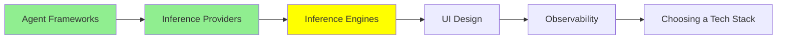

# Inference Engines

*(Placeholder module — a short overview for now; full lesson content is coming soon.)*

Software for running models yourself, from a laptop GUI to production-grade serving stacks.

**Topics this module will cover**:
- Ollama
- LM Studio
- Open WebUI
- llama.cpp
- TensorRT
- llm-d

## Tutorial Progress

