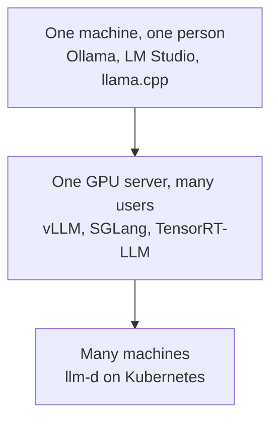

# Inference Engines

[LLM Fundamentals](../1_fundamentals/llms.md) named the engines and then said you rarely touch them directly, which is true and is why that module moved straight on to Ollama. This one is about the times you do touch them.

An **inference engine** is the program that loads the weights and turns your tokens into the next token. It manages GPU memory, batches requests together, caches attention state between turns and decides what runs in what order. [Inference Providers](inference_providers.md) is somebody else running one of these for you and charging per token.

## Why you would run it yourself

Three reasons, and only three worth the trouble.

**The data cannot leave.** Health records, legal documents, anything under a rule that says the text stays on your infrastructure. This is the most common reason by a wide margin and it settles the question on its own.

**The volume makes it cheaper.** Per-token pricing is excellent until it is not. There is a crossover point where a rented GPU running all day beats the same work bought by the token, and if you are past it the arithmetic is not close.

**You need something a provider will not give you.** A fine-tuned model of your own from [Training LLMs](../1_fundamentals/training.md), a model nobody hosts, an unusual quantization, or control over the exact version so an upgrade never surprises you.

If none of those is true, use a provider. Self-hosting is a real operational job and the first month is mostly learning what you did not budget for.

## The engines, by the size of the problem

**On your own machine**, use the wrappers. [LLM Fundamentals](../1_fundamentals/llms.md) covered [Ollama](https://ollama.com/) and [LM Studio](https://lmstudio.ai/), and they are the right answer: they hide the engine and get you running in minutes. Underneath, both lean on **[llama.cpp](https://github.com/ggml-org/llama.cpp)**, which is LLM inference in C and C++ and the reason a quantized model runs on a laptop at all. Go to llama.cpp directly when you want a build flag the wrapper does not expose, or you are putting a model on hardware nobody else supports.

**On a GPU server with real users**, the wrappers stop being enough and you want a serving engine.

- **vLLM** is the usual default. Broad hardware support, and its continuous batching is what makes throughput respectable.
- **[SGLang](https://github.com/sgl-project/sglang)** is a high-performance serving framework for language and multimodal models, and it is strong where requests share a long common prefix. If every request starts with the same big system prompt, that is exactly your case.
- **[TensorRT-LLM](https://github.com/NVIDIA/TensorRT-LLM)** is NVIDIA's, and goes furthest on NVIDIA hardware specifically. You compile the model into an optimised engine ahead of time, which costs you a build step and buys you latency.

**Across many machines**, serving becomes a cluster problem rather than a process problem, and that is what **[llm-d](https://github.com/llm-d/llm-d)** is for: inference on Kubernetes with modern accelerators, so scheduling, routing and cache-aware placement are handled by the platform rather than by you.

## The one idea that explains the numbers

If you take away one mechanism, take **batching**.

A GPU running one request at a time is mostly idle, because generating a token is a small amount of arithmetic against a huge amount of memory traffic. Run many requests together and the same weight-loading pays for all of them at once. That is why throughput on these engines is measured with many concurrent users, and why the same hardware can look brilliant or hopeless depending only on how full the batch is.

Continuous batching is the refinement that matters in practice: instead of waiting for a batch to finish, the engine slots new requests in as older ones complete, so the GPU never drains. This is also why your own benchmark of one request at a time will mislead you badly about what the server can do.

And it connects to [Context Engineering](../2_intermediate/context_engineering.md) from the other side. The attention state for a long context has to live in GPU memory, so a full context window is not only slower to reason over, it is also taking room that another user's request needed.

## Something to put in front of it

An engine gives you an API and nothing to look at. **[Open WebUI](https://github.com/open-webui/open-webui)** is the interface people put in front of one: a chat UI that talks to Ollama or to anything speaking the OpenAI API shape, with accounts, conversation history and model switching. For a team that wants a private ChatGPT on its own hardware, that is the whole stack in two pieces.

## Where this fits in the series

## Summary

An inference engine is the program that actually runs the weights: GPU memory, batching, attention cache, scheduling. A provider is somebody else operating one for you.

Run your own for one of three reasons. The data cannot leave your infrastructure, the volume has passed the point where renting a GPU is cheaper than buying tokens, or you need a model or a version nobody hosts. Otherwise use a provider, because self-hosting is an operational job.

Match the engine to the size of the problem. Ollama or LM Studio on your own machine, with llama.cpp underneath. vLLM, SGLang or TensorRT-LLM on a GPU server with real users, where SGLang suits a shared long prefix and TensorRT-LLM goes furthest on NVIDIA. llm-d when it becomes a cluster.

Batching is the idea that explains every number in this module. A GPU serving one request is mostly idle, and continuous batching keeps it full, which is why benchmarking one request at a time tells you almost nothing.

**Quick Check**: you measure your self-hosted model with one request at a time and it looks fast. Why might it collapse with fifty users, and what would you have measured instead?

## References

- [llama.cpp](https://github.com/ggml-org/llama.cpp): inference in C and C++, and what the local wrappers are built on
- [SGLang](https://github.com/sgl-project/sglang): high-performance serving, strong on a shared prefix
- [TensorRT-LLM](https://github.com/NVIDIA/TensorRT-LLM): NVIDIA's, compiled ahead of time for latency
- [llm-d](https://github.com/llm-d/llm-d): serving across many machines on Kubernetes
- [Open WebUI](https://github.com/open-webui/open-webui): the chat interface to put in front of any of them
- [Ollama](https://ollama.com/) and [LM Studio](https://lmstudio.ai/): the local wrappers, covered in [LLM Fundamentals](../1_fundamentals/llms.md)
