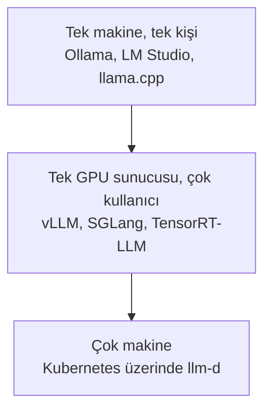

# Inference Engine'ler

[LLM Fundamentals](../1_fundamentals/llms_tr.md) engine'leri adlandırdı ve sonra onlara doğrudan nadiren dokunduğunu söyledi, ki doğru, ve o modülün hemen Ollama'ya geçmesinin sebebi de bu. Bu modül dokunduğun zamanlarla ilgili.

Bir **inference engine**, weight'leri yükleyen ve token'larını sıradaki token'a çeviren program. GPU memory'yi yönetiyor, istekleri birlikte batch'liyor, turlar arasında attention state'ini cache'liyor ve neyin hangi sırada çalışacağına karar veriyor. [Inference Provider'lar](inference_providers_tr.md), başka birinin senin için bunlardan birini çalıştırıp token başına ücret alması.

## Kendin çalıştırmanın sebepleri

Üç sebep, ve zahmete değen sadece üç tane.

**Veri çıkamıyor.** Sağlık kayıtları, hukuki dokümanlar, metnin altyapında kalmasını söyleyen bir kural altındaki her şey. Bu, açık ara en yaygın sebep ve soruyu tek başına çözüyor.

**Hacim onu daha ucuz yapıyor.** Token başına fiyatlama, olmadığı ana kadar mükemmel. Gün boyu çalışan kiralık bir GPU'nun aynı işi token'la satın almayı yendiği bir kesişme noktası var, ve onu geçtiysen hesap yakın bile değil.

**Bir provider'ın vermeyeceği bir şeye ihtiyacın var.** [Training LLMs](../1_fundamentals/training_tr.md)'den kendi fine-tune ettiğin bir model, kimsenin barındırmadığı bir model, alışılmadık bir quantization, ya da bir yükseltmenin seni asla şaşırtmaması için tam sürüm üzerinde kontrol.

Bunların hiçbiri doğru değilse bir provider kullan. Self-hosting gerçek bir operasyon işi ve ilk ay çoğunlukla bütçelemediğin şeyi öğrenmek.

## Engine'ler, problemin boyutuna göre

**Kendi makinende** wrapper'ları kullan. [LLM Fundamentals](../1_fundamentals/llms_tr.md) [Ollama](https://ollama.com/) ile [LM Studio](https://lmstudio.ai/)'yu işlemişti, ve doğru cevap onlar: engine'i saklıyorlar ve seni dakikalar içinde çalıştırıyorlar. Altta ikisi de **[llama.cpp](https://github.com/ggml-org/llama.cpp)**'ye yaslanıyor, ki o da C ve C++'ta LLM inference, ve quantize edilmiş bir modelin bir laptop'ta hiç çalışmasının sebebi. llama.cpp'ye doğrudan, wrapper'ın açmadığı bir build flag'i istediğinde ya da bir modeli kimsenin desteklemediği bir donanıma koyuyorken git.

**Gerçek kullanıcıları olan bir GPU sunucusunda** wrapper'lar yetmemeye başlıyor ve bir serving engine istiyorsun.

- **vLLM** alışılmış varsayılan. Geniş donanım desteği, ve continuous batching'i throughput'u saygın yapan şey.
- **[SGLang](https://github.com/sgl-project/sglang)** dil ve multimodal modeller için yüksek performanslı bir serving framework'ü, ve isteklerin uzun bir ortak öneki paylaştığı yerde güçlü. Her istek aynı büyük system prompt'la başlıyorsa, durumun tam olarak bu.
- **[TensorRT-LLM](https://github.com/NVIDIA/TensorRT-LLM)** NVIDIA'nın, ve özellikle NVIDIA donanımında en ileri gideni. Modeli önceden optimize edilmiş bir engine'e derliyorsun, ki bu sana bir build adımına mal oluyor ve gecikme kazandırıyor.

**Çok makine boyunca** serving bir process problemi olmaktan çıkıp bir cluster problemi oluyor, ve **[llm-d](https://github.com/llm-d/llm-d)** de bunun için: modern hızlandırıcılarla Kubernetes üzerinde inference, böylece zamanlama, yönlendirme ve cache'e duyarlı yerleşim senin yerine platform tarafından hallediliyor.

## Sayıları açıklayan tek fikir

Tek bir mekanizma alacaksan, **batching**'i al.

Bir seferde tek istek çalıştıran bir GPU çoğunlukla boş, çünkü bir token üretmek, kocaman bir memory trafiğine karşı küçük bir miktar aritmetik. Birçok isteği birlikte çalıştır ve aynı weight yüklemesi hepsinin bedelini bir defada ödüyor. Bu engine'lerde throughput'un çok eşzamanlı kullanıcıyla ölçülmesinin, ve aynı donanımın sadece batch'in ne kadar dolu olduğuna bağlı olarak parlak ya da umutsuz görünebilmesinin sebebi bu.

Continuous batching, pratikte önemli olan incelik: bir batch'in bitmesini beklemek yerine, engine eskiler tamamlandıkça yeni istekleri araya yerleştiriyor, böylece GPU hiç boşalmıyor. Bu aynı zamanda senin bir seferde tek istekle yaptığın benchmark'ın sunucunun ne yapabileceği konusunda seni fena yanıltmasının sebebi.

Ve öbür taraftan [Context Engineering](../2_intermediate/context_engineering_tr.md)'e bağlanıyor. Uzun bir context'in attention state'inin GPU memory'de yaşaması gerekiyor, yani dolu bir context window sadece üzerinde akıl yürütmesi daha yavaş değil, aynı zamanda başka bir kullanıcının isteğinin ihtiyaç duyduğu yeri de alıyor.

## Önüne koyacak bir şey

Bir engine sana bir API ve bakacak hiçbir şey vermiyor. **[Open WebUI](https://github.com/open-webui/open-webui)** insanların birinin önüne koyduğu arayüz: Ollama'yla ya da OpenAI API şeklini konuşan her şeyle konuşan bir sohbet arayüzü; hesaplar, konuşma geçmişi ve model değiştirmeyle. Kendi donanımında özel bir ChatGPT isteyen bir ekip için bütün stack iki parçadan ibaret.

## Bu serinin neresindeyiz

## Özet

Bir inference engine, weight'leri gerçekten çalıştıran program: GPU memory, batching, attention cache, zamanlama. Bir provider da senin için birini işleten başka biri.

Kendininkini üç sebepten biriyle çalıştır. Veri altyapından çıkamıyor, hacim kiralık bir GPU'nun token satın almaktan ucuz olduğu noktayı geçti, ya da kimsenin barındırmadığı bir modele veya sürüme ihtiyacın var. Aksi hâlde bir provider kullan, çünkü self-hosting bir operasyon işi.

Engine'i problemin boyutuna eşle. Kendi makinende Ollama ya da LM Studio, altta llama.cpp ile. Gerçek kullanıcıları olan bir GPU sunucusunda vLLM, SGLang ya da TensorRT-LLM; SGLang paylaşılan uzun bir öneke, TensorRT-LLM de NVIDIA'da en ileriye uygun. Bir cluster'a dönüştüğünde llm-d.

Batching bu modüldeki her sayıyı açıklayan fikir. Tek istek sunan bir GPU çoğunlukla boş, ve continuous batching onu dolu tutuyor, ki bir seferde tek istekle benchmark yapmanın sana neredeyse hiçbir şey söylememesinin sebebi de bu.

**Hızlı Kontrol**: kendi barındırdığın modeli bir seferde tek istekle ölçüyorsun ve hızlı görünüyor. Elli kullanıcıyla neden çökebilir, ve onun yerine neyi ölçmeliydin?

## Kaynaklar

- [llama.cpp](https://github.com/ggml-org/llama.cpp): C ve C++'ta inference, ve lokal wrapper'ların üzerine kurulduğu şey
- [SGLang](https://github.com/sgl-project/sglang): yüksek performanslı serving, paylaşılan bir önekte güçlü
- [TensorRT-LLM](https://github.com/NVIDIA/TensorRT-LLM): NVIDIA'nın, gecikme için önceden derlenmiş
- [llm-d](https://github.com/llm-d/llm-d): Kubernetes üzerinde çok makine boyunca serving
- [Open WebUI](https://github.com/open-webui/open-webui): herhangi birinin önüne koyacağın sohbet arayüzü
- [Ollama](https://ollama.com/) ve [LM Studio](https://lmstudio.ai/): lokal wrapper'lar, [LLM Fundamentals](../1_fundamentals/llms_tr.md)'te işlendi
