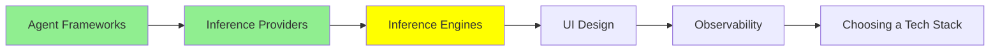

# Inference Motorları

*(Bu bir placeholder modül — şimdilik kısa bir özet; tam ders içeriği yakında geliyor.)*

Modelleri kendin çalıştırmak için kullanılan yazılımlar; bir laptop GUI'sinden production-seviyesi serving stack'lerine kadar.

**Bu modülde işlenecek konular**:
- Ollama
- LM Studio
- Open WebUI
- llama.cpp
- TensorRT
- llm-d

## Eğitim İlerlemesi

