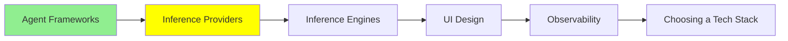

# Inference Providers

[LLM Fundamentals](../1_fundamentals/llms.md) got you an API key and a first call. This module is about the layer that key belongs to, and what changes once the calls are not free any more.

An **inference provider** runs the model on their hardware and rents you access to it. You send text, you get text back, and you pay per token. You own none of the machines and none of the weights.

There are two ways to buy that, and they are worth keeping straight.

## The gateway

[OpenRouter](https://openrouter.ai/) sits in front of many providers. One key, one API shape, and a model name in the request decides who actually serves it. [LLM Fundamentals](../1_fundamentals/llms.md) already showed the shape of it, so here is what it buys you once you are past learning:

- **You can change model in one line.** Same code, different string. When a new model appears on a Monday you can have it in your product by lunchtime, and you can compare three of them on your own task in an afternoon.
- **No key sprawl.** No separate account, billing relationship and rate limit per vendor.
- **Failover.** When one provider is having an outage the request can go somewhere else instead of failing.
- **The same model from several sellers.** An open-weights model is often served by half a dozen providers at different prices and speeds, and a gateway lets you pick on price, on latency, or on whichever is up.

The cost is a hop. Your request goes through somebody else's infrastructure, which adds a little latency and puts one more company between you and the model.

## Going direct

The other way is straight to the company that made the model: OpenAI, Anthropic, Google.

You do this when you want the things only the maker ships. New models usually land there first. The provider-specific features live there, and those are not small: prompt caching that cuts the cost of a long system prompt, batch endpoints at a discount, the newest tool-calling behaviour, and the higher rate limits you get by talking to a salesperson. If you are building on one model and you are past the experiment, direct is usually where you end up.

Nothing stops you doing both. A common shape is direct for the model in production and a gateway for evaluating everything else.

## What to compare, beyond the price

The price per million tokens is the number everyone quotes and the worst one to decide on alone. What actually shows up on the bill and in the product:

- **Prompt caching.** If your system prompt is long and stable, a provider that caches it charges you a fraction for the repeat. On an agent that sends the same 5,000-token preamble every turn, this is the single biggest lever there is. It is also why the harness comparison in [Harness Engineering](../2_intermediate/harness_engineering.md) found the fastest tool was the most expensive per success: it barely reused its cache.
- **Rate limits.** Requests and tokens per minute. A generous per-token price is no use if you are queueing.
- **Latency, and which kind.** Time to the first token is what a person waiting on a chat feels. Total time is what a batch job feels. They are different numbers and providers are not good at both.
- **Context window and output limit.** These are separate, and the output limit is the one people forget until a long answer gets cut off.
- **What happens to your data.** Whether prompts are retained, for how long, and whether they can be trained on. For anything with customer data in it, read this before the price.
- **Quantization.** On a gateway especially, the same model name can be served at different precisions, and a cheaper seller may be running a more aggressively quantized copy. [LLM Fundamentals](../1_fundamentals/llms.md) explained what that costs in quality.

## Starting for free

Both of the routes below have free tiers with daily limits, which is enough to build something real on.

**[Google AI Studio](https://aistudio.google.com/)** is the most generous of the big vendors: sign up, get a key, and the free tier covers the ordinary models with a daily cap. **OpenRouter** carries free models with daily limits too, and it is the fastest way to try several models against one prompt without opening accounts.

One warning about free tiers, because it catches people at exactly the wrong moment. A free tier tells you whether the model can do your task. It tells you almost nothing about what your product will feel like, because free capacity is slower, rate limited harder, and first to be shed when the provider is busy. Measure latency on the tier you intend to pay for.

## Where this fits in the series

## Summary

An inference provider runs the model and rents you access per token. You buy that either through a gateway or direct from the maker.

A gateway, and OpenRouter is the one to know, gives you one key for many models, a one-line model swap, failover when a provider is down, and a choice of sellers for the same open-weights model. It costs you one extra hop.

Direct gives you the things only the maker ships: new models first, prompt caching, batch discounts, and the rate limits you negotiate. Most teams use a gateway to evaluate and go direct for the model they ship.

When you compare them, the price per token is the least useful number on the page. Prompt caching, rate limits, time to first token, the output limit and the data policy all decide more. And measure latency on the paid tier, because the free one is not the product you are shipping.

**Quick Check**: your agent sends the same long system prompt on every turn. Which line of a provider's pricing page matters most, and why is it not the price per token?

## References

- [OpenRouter](https://openrouter.ai/): one key for many models, and the fastest way to compare them
- [Google AI Studio](https://aistudio.google.com/): a free key and a daily allowance, enough to learn on
- [LLM Fundamentals](../1_fundamentals/llms.md): where the first API call and the quantization trade-off are explained
