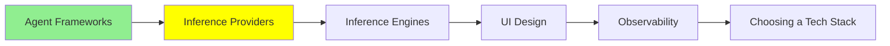

# Inference Providers

*(Placeholder module — a short overview for now; full lesson content is coming soon.)*

Hosted APIs that serve LLM inference, so you don't have to run any hardware yourself.

**Topics this module will cover**:
- OpenRouter
- OpenAI
- Google AI Studio

## Tutorial Progress

