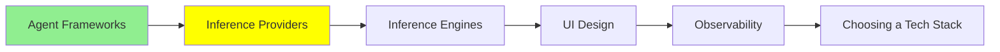

# Inference Sağlayıcıları

*(Bu bir placeholder modül — şimdilik kısa bir özet; tam ders içeriği yakında geliyor.)*

Kendi donanımını çalıştırmana gerek kalmadan LLM inference'ı API olarak sunan hizmetler.

**Bu modülde işlenecek konular**:
- OpenRouter
- OpenAI
- Google AI Studio

## Eğitim İlerlemesi

