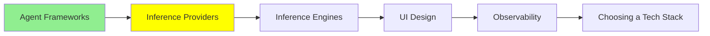

# Inference Provider'lar

[LLM Fundamentals](../1_fundamentals/llms_tr.md) sana bir API key ve ilk çağrıyı verdi. Bu modül o key'in ait olduğu katmanla, ve çağrılar bedava olmaktan çıkınca neyin değiştiğiyle ilgili.

Bir **inference provider** modeli kendi donanımında çalıştırıyor ve sana erişimi kiralıyor. Metin gönderiyorsun, metin geri alıyorsun, ve token başına ödüyorsun. Ne makinelerin ne de weight'lerin sahibi sensin.

Bunu satın almanın iki yolu var, ve ayrı tutmaya değer.

## Gateway

[OpenRouter](https://openrouter.ai/) birçok provider'ın önünde duruyor. Tek key, tek API şekli, ve istekteki bir model adı gerçekte kimin sunacağına karar veriyor. [LLM Fundamentals](../1_fundamentals/llms_tr.md) şeklini zaten göstermişti, o yüzden burada öğrenme aşamasını geçtikten sonra sana ne kazandırdığı var:

- **Modeli tek satırda değiştirebiliyorsun.** Aynı kod, farklı bir string. Pazartesi yeni bir model çıktığında öğlene kadar ürününde olabiliyor, ve üç tanesini kendi işinde bir öğleden sonrada karşılaştırabiliyorsun.
- **Key kalabalığı yok.** Vendor başına ayrı hesap, faturalama ilişkisi ve rate limit yok.
- **Failover.** Bir provider'da kesinti olduğunda istek düşmek yerine başka bir yere gidebiliyor.
- **Aynı model birkaç satıcıdan.** Açık ağırlıklı bir model genelde yarım düzine provider tarafından farklı fiyat ve hızlarda sunuluyor, ve bir gateway fiyata, gecikmeye ya da hangisi ayaktaysa ona göre seçmene izin veriyor.

Maliyeti bir sıçrama. İsteğin başka birinin altyapısından geçiyor, ki bu da biraz gecikme ekliyor ve seninle model arasına bir şirket daha koyuyor.

## Doğrudan gitmek

Öbür yol doğrudan modeli yapan şirkete: OpenAI, Anthropic, Google.

Bunu, sadece yapanın sunduğu şeyleri istediğinde yapıyorsun. Yeni modeller genelde önce orada iniyor. Provider'a özel feature'lar orada yaşıyor, ve onlar küçük şeyler değil: uzun bir system prompt'un maliyetini kesen prompt caching, indirimli batch endpoint'leri, en yeni tool-calling davranışı, ve bir satış temsilcisiyle konuşarak aldığın daha yüksek rate limit'ler. Tek bir model üzerine kuruyorsan ve deneyi geçtiysen, doğrudan genelde vardığın yer.

İkisini birden yapmana hiçbir şey engel değil. Yaygın bir şekil, production'daki model için doğrudan ve geri kalan her şeyi değerlendirmek için bir gateway.

## Fiyatın ötesinde neyi karşılaştırmalı

Milyon token başına fiyat herkesin söylediği sayı ve tek başına karar vermek için en kötüsü. Faturada ve üründe gerçekte görünen şeyler:

- **Prompt caching.** System prompt'un uzun ve durağansa, onu cache'leyen bir provider tekrarı için sana bir kesir ödetiyor. Her turda aynı 5.000 token'lık girişi gönderen bir agent'ta bu, var olan en büyük kaldıraç. [Harness Engineering](../2_intermediate/harness_engineering_tr.md)'deki harness karşılaştırmasının en hızlı tool'u başarı başına en pahalı bulmasının sebebi de bu: cache'ini neredeyse hiç yeniden kullanmıyordu.
- **Rate limit'ler.** Dakika başına istek ve token. Kuyrukta bekliyorsan cömert bir token fiyatının faydası yok.
- **Gecikme, ve hangi türü.** İlk token'a kadar geçen süre, bir sohbette bekleyen insanın hissettiği şey. Toplam süre ise bir batch işinin hissettiği şey. Bunlar farklı sayılar ve provider'lar ikisinde de iyi olmakta iyi değil.
- **Context window ve output limiti.** Bunlar ayrı, ve output limiti insanların uzun bir cevap kesilene kadar unuttuğu olan.
- **Verine ne olduğu.** Prompt'ların tutulup tutulmadığı, ne kadar süre, ve üzerinde eğitim yapılabilip yapılamayacağı. İçinde müşteri verisi olan her şey için bunu fiyattan önce oku.
- **Quantization.** Özellikle bir gateway'de aynı model adı farklı hassasiyetlerde sunulabiliyor, ve daha ucuz bir satıcı daha agresif quantize edilmiş bir kopya çalıştırıyor olabilir. [LLM Fundamentals](../1_fundamentals/llms_tr.md) bunun kaliteye ne mal olduğunu anlatmıştı.

## Bedava başlamak

Aşağıdaki iki yolun da günlük limitli bedava katmanları var, ki bu da üzerine gerçek bir şey kurmaya yetiyor.

**[Google AI Studio](https://aistudio.google.com/)** büyük vendor'lar arasında en cömert olanı: kaydol, bir key al, ve bedava katman sıradan modelleri günlük bir üst sınırla kapsıyor. **OpenRouter** da günlük limitli bedava modeller taşıyor, ve tek bir prompt'a karşı birkaç modeli hesap açmadan denemenin en hızlı yolu.

Bedava katmanlar hakkında bir uyarı, çünkü insanları tam yanlış anda yakalıyor. Bedava bir katman sana modelin işini yapabilip yapamadığını söylüyor. Ürününün nasıl hissettireceği hakkında neredeyse hiçbir şey söylemiyor, çünkü bedava kapasite daha yavaş, daha sert rate limit'li, ve provider meşgulken ilk kesilen. Gecikmeyi ödemeyi planladığın katmanda ölç.

## Bu serinin neresindeyiz

## Özet

Bir inference provider modeli çalıştırıyor ve sana token başına erişim kiralıyor. Bunu ya bir gateway üzerinden ya da doğrudan yapandan satın alıyorsun.

Bir gateway, ki bilinmesi gereken OpenRouter, sana birçok model için tek key, tek satırlık model değişimi, bir provider düştüğünde failover, ve aynı açık ağırlıklı model için satıcı seçimi veriyor. Sana bir fazladan sıçrama maliyeti çıkarıyor.

Doğrudan gitmek sadece yapanın sunduğu şeyleri veriyor: önce yeni modeller, prompt caching, batch indirimleri, ve pazarlıkla aldığın rate limit'ler. Çoğu ekip değerlendirmek için bir gateway kullanıp ürettikleri model için doğrudan gidiyor.

Onları karşılaştırırken token başına fiyat sayfadaki en az faydalı sayı. Prompt caching, rate limit'ler, ilk token'a kadar süre, output limiti ve veri politikası hepsi daha çok karar veriyor. Ve gecikmeyi ödemeli katmanda ölç, çünkü bedava olan gönderdiğin ürün değil.

**Hızlı Kontrol**: agent'ın her turda aynı uzun system prompt'u gönderiyor. Bir provider'ın fiyat sayfasındaki hangi satır en çok önemli, ve neden token başına fiyat değil?

## Kaynaklar

- [OpenRouter](https://openrouter.ai/): birçok model için tek key, ve onları karşılaştırmanın en hızlı yolu
- [Google AI Studio](https://aistudio.google.com/): bedava bir key ve günlük bir hak, öğrenmeye yeter
- [LLM Fundamentals](../1_fundamentals/llms_tr.md): ilk API çağrısının ve quantization ödününün anlatıldığı yer
