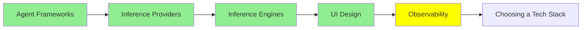

# Observability

*(Placeholder module — a short overview for now; full lesson content is coming soon.)*

Watching what your agents actually do — every prompt, tool call, and decision along the way.

**Topics this module will cover**:
- LangSmith
- LangFuse
- Trace-analyzer agents

## Tutorial Progress

