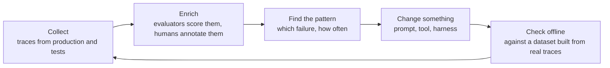
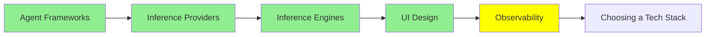

# Observability

In ordinary software, when you want to know what the system does, you read the code. The code is the behaviour.

That stops being true with an agent. The code says "call the model, then run whatever tool it asks for, then go round again". What actually happened on any given run, which tools it chose, in what order, what came back, where it went wrong, is not in the code at all. It only exists in the record of that run.

That record is a **trace**, and this module is about keeping it and using it.

## What a trace holds

A trace is the whole tree of one request. Every model call with its input and its output, every tool call with its arguments and its result, every subagent, and on each of them the tokens, the cost and the duration.

That shape matters, because agent failures live in the gaps between steps rather than inside any one of them. The model asked for the right tool with a slightly wrong argument. A tool returned an empty list and the agent treated it as an answer. It looped four times over the same file. It hit the context limit and quietly dropped the instruction it needed. None of that is visible in the final output, which is often a confident paragraph. All of it is visible in a trace.

Which is why LangChain put it as plainly as they did in [The Agent Improvement Loop Starts with a Trace](https://www.langchain.com/blog/traces-start-agent-improvement-loop): in traditional software the code documents the behaviour, and in an agentic system the traces do.

## Where to put them

- **LangSmith** is LangChain's, and the most integrated if you are already using anything from [Agent Frameworks](agent_frameworks.md). Tracing, datasets, evaluators and annotation in one place.
- **[Langfuse](https://github.com/langfuse/langfuse)** is the open-source one, and the usual answer when the traces must stay on your own infrastructure. It speaks OpenTelemetry as well as the framework SDKs, so it collects from almost anything, and it carries evals, prompt management and datasets alongside the traces.
- **[Latitude](https://github.com/latitude-dev/latitude-llm)** is also open source, aimed squarely at monitoring in production.

The thing to check before you pick is not the feature list. It is whether it collects from what you already run, and whether it can keep the traces where your data policy says they have to live. Prompts and tool results are full of customer text, which puts this in the same conversation as the data policy from [Inference Providers](inference_providers.md).

## The loop

Collecting traces is not the point. The point is the cycle they start, which is the argument of that LangChain piece:

*Every stage is attached to the same object, which is why the loop closes at all. Evaluators score traces. Annotations attach to traces. The offline dataset is made of traces. The regression test replays them. Take the trace away and none of these steps can reach each other.*

And it compounds. Each pass produces better data, better data locates failures more precisely, and the next change is aimed better than the last. This is the verification loop from [Loop Engineering](../2_intermediate/loop_engineering.md), running on a longer timescale with a human in it.

## The problem nobody expected

Then teams got good at collecting traces and hit the wall on the other side. From [From Traces to Insights](https://www.langchain.com/blog/from-traces-to-insights-understanding-agent-behavior-at-scale), a developer describing their own situation: they record over 100,000 traces every single day, and what are they doing with those traces? Literally nothing.

Nobody reads a hundred thousand of anything. And the usual instruments do not save you, because product analytics and online evaluators both answer questions you already thought to ask. They will tell you the failure rate on the check you wrote. They cannot tell you about the failure mode you have never imagined, which is the one costing you users.

So the newest tool in this module is **an agent that reads the traces**. LangSmith's Insights Agent clusters thousands of conversations to surface the usage patterns and failure modes on its own, with nobody specifying what to look for in advance. It is exploratory analysis of a pile too big for a person, done by the same technology that produced the pile.

Which is where this series has been heading all along. [Loop Engineering](../2_intermediate/loop_engineering.md) ended on an agent designing the loop; this is an agent auditing the output. And it is worth noticing that the reason any of it is necessary is the fact [Harness Engineering](../2_intermediate/harness_engineering.md) started from: these systems are non-deterministic, they take unbounded natural language as input, and most of their failures therefore turn up in production rather than in your tests.

## Where this fits in the series

## Summary

In ordinary software the code tells you what the system does. In an agent it does not, because the code only describes the loop. What happened on a particular run exists only in the trace: every model call, every tool call, every subagent, with the tokens, cost and duration on each.

That is where agent failures are visible, since they live in the gaps between steps. A slightly wrong argument, an empty result treated as an answer, four passes over the same file, an instruction quietly lost at the context limit. The final output hides all of it.

LangSmith is the integrated choice, Langfuse the open-source one for when traces must stay on your infrastructure, and Latitude another open option focused on production monitoring.

Collecting them is not the point. The loop is: collect, enrich with evaluators and annotations, find the pattern, change something, check it offline against a dataset made from real traces, and go round with better data than last time.

And once there are a hundred thousand traces a day, nobody reads them. Analytics and evaluators only answer questions you already thought of, so the newest answer is an agent that clusters the traces and finds the failure modes you never imagined.

**Quick Check**: your agent gives a confident, wrong answer. What would a trace show you that the output cannot?

## References

- [The Agent Improvement Loop Starts with a Trace](https://www.langchain.com/blog/traces-start-agent-improvement-loop): why the traces document the behaviour now, and the loop they start
- [From Traces to Insights: Understanding Agent Behavior at Scale](https://www.langchain.com/blog/from-traces-to-insights-understanding-agent-behavior-at-scale): the hundred-thousand-traces problem, and clustering as the way out
- [Langfuse](https://github.com/langfuse/langfuse): open source, OpenTelemetry-compatible, with evals and prompt management alongside the traces
- [Latitude](https://github.com/latitude-dev/latitude-llm): open-source monitoring, aimed at production
