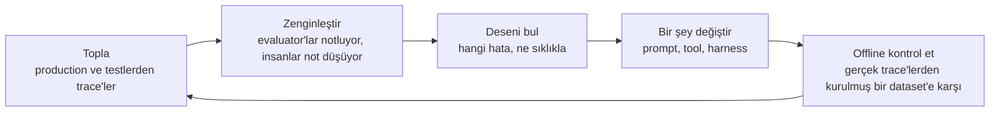
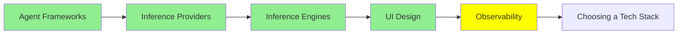

# Observability

Sıradan yazılımda, sistemin ne yaptığını bilmek istediğinde kodu okuyorsun. Kod, davranışın kendisi.

Bir agent'ta bu doğru olmaktan çıkıyor. Kod "modeli çağır, sonra istediği tool'u çalıştır, sonra baştan git" diyor. Herhangi bir çalışmada gerçekte ne olduğu, hangi tool'ları seçtiği, hangi sırada, ne geri geldiği, nerede yanlış gittiği, kodda hiç yok. Sadece o çalışmanın kaydında var.

O kayıt bir **trace**, ve bu modül onu tutmak ve kullanmakla ilgili.

## Bir trace neyi tutuyor

Bir trace, tek bir isteğin bütün ağacı. Her model çağrısı input'u ve output'uyla, her tool çağrısı argümanları ve sonucuyla, her subagent, ve her birinin üzerinde token'lar, maliyet ve süre.

O şekil önemli, çünkü agent hataları herhangi birinin içinde değil adımlar arasındaki boşluklarda yaşıyor. Model doğru tool'u biraz yanlış bir argümanla istedi. Bir tool boş bir liste döndürdü ve agent bunu cevap saydı. Aynı dosyanın üzerinde dört kez döndü. Context limitine çarptı ve ihtiyacı olan talimatı sessizce düşürdü. Bunların hiçbiri son çıktıda görünmüyor, ki o da genelde kendinden emin bir paragraf. Hepsi bir trace'te görünüyor.

LangChain'in [The Agent Improvement Loop Starts with a Trace](https://www.langchain.com/blog/traces-start-agent-improvement-loop) yazısında bunu bu kadar düpedüz koymasının sebebi de bu: geleneksel yazılımda davranışı kod dokümante ediyor, agentic bir sistemde trace'ler ediyor.

## Nereye koyulacağı

- **LangSmith** LangChain'in, ve [Agent Framework'leri](agent_frameworks_tr.md)'nden bir şey kullanıyorsan en entegre olanı. Tracing, dataset'ler, evaluator'lar ve annotation tek bir yerde.
- **[Langfuse](https://github.com/langfuse/langfuse)** açık kaynak olanı, ve trace'lerin kendi altyapında kalması gerektiğinde alışılmış cevap. Framework SDK'larının yanında OpenTelemetry de konuşuyor, yani neredeyse her şeyden toplayabiliyor, ve trace'lerin yanında eval'ler, prompt yönetimi ve dataset'ler taşıyor.
- **[Latitude](https://github.com/latitude-dev/latitude-llm)** de açık kaynak, doğrudan production'da izlemeye yönelmiş.

Seçmeden önce kontrol edilecek şey feature listesi değil. Zaten çalıştırdığın şeyden toplayıp toplamadığı, ve trace'leri veri politikanın yaşamalarını söylediği yerde tutabilip tutamadığı. Prompt'lar ve tool sonuçları müşteri metniyle dolu, ki bu da bunu [Inference Provider'lar](inference_providers_tr.md)'daki veri politikasıyla aynı konuşmaya koyuyor.

## Loop

Trace toplamak amaç değil. Amaç, onların başlattığı döngü, ki o LangChain yazısının argümanı da bu:

*Her aşama aynı nesneye bağlı, ve loop'un hiç kapanmasının sebebi de bu. Evaluator'lar trace'leri notluyor. Not'lar trace'lere ekleniyor. Offline dataset trace'lerden yapılıyor. Regression test'i onları yeniden çalıştırıyor. Trace'i çıkar, ve bu adımların hiçbiri birbirine ulaşamıyor.*

Ve birikiyor. Her geçiş daha iyi veri üretiyor, daha iyi veri hataları daha kesin yerleştiriyor, ve sonraki değişiklik bir öncekinden daha iyi nişanlanıyor. Bu, [Loop Engineering](../2_intermediate/loop_engineering_tr.md)'deki verification loop'un, daha uzun bir zaman ölçeğinde ve içinde bir insanla çalışan hâli.

## Kimsenin beklemediği problem

Sonra ekipler trace toplamakta iyileşti ve öbür taraftaki duvara çarptı. [From Traces to Insights](https://www.langchain.com/blog/from-traces-to-insights-understanding-agent-behavior-at-scale)'ten, kendi durumunu anlatan bir geliştirici: her gün 100.000'den fazla trace kaydediyorlar, ve o trace'lerle ne yapıyorlar? Kelimenin tam anlamıyla hiçbir şey.

Kimse yüz bin şeyi okumuyor. Ve alışılmış aletler seni kurtarmıyor, çünkü ürün analitiği ve online evaluator'lar ikisi de sormayı zaten düşündüğün soruları cevaplıyor. Yazdığın kontroldeki hata oranını sana söylerler. Hiç hayal etmediğin hata modunu söyleyemezler, ki sana kullanıcı kaybettiren de o.

Yani bu modüldeki en yeni tool, **trace'leri okuyan bir agent**. LangSmith'in Insights Agent'ı binlerce konuşmayı kümeleyerek kullanım desenlerini ve hata modlarını kendi başına yüzeye çıkarıyor; kimse önceden neye bakılacağını belirtmeden. Bir insan için fazla büyük bir yığının keşifsel analizi, yığını üreten teknolojinin kendisi tarafından yapılıyor.

Bu serinin baştan beri gittiği yer de burası. [Loop Engineering](../2_intermediate/loop_engineering_tr.md) loop'u tasarlayan bir agent'la bitiyordu; bu da çıktıyı denetleyen bir agent. Ve bunların hiçbirinin gerekli olmasının sebebinin [Harness Engineering](../2_intermediate/harness_engineering_tr.md)'in başladığı gerçek olduğuna dikkat etmeye değer: bu sistemler non-deterministic, sınırsız doğal dili input olarak alıyorlar, ve dolayısıyla hatalarının çoğu testlerinde değil production'da ortaya çıkıyor.

## Bu serinin neresindeyiz

## Özet

Sıradan yazılımda sistemin ne yaptığını sana kod söylüyor. Bir agent'ta söylemiyor, çünkü kod sadece loop'u anlatıyor. Belirli bir çalışmada ne olduğu sadece trace'te var: her model çağrısı, her tool çağrısı, her subagent; her birinde token, maliyet ve süreyle.

Agent hatalarının göründüğü yer orası, çünkü adımlar arasındaki boşluklarda yaşıyorlar. Biraz yanlış bir argüman, cevap sayılan boş bir sonuç, aynı dosyada dört geçiş, context limitinde sessizce kaybolan bir talimat. Son çıktı bunların hepsini saklıyor.

LangSmith entegre seçenek, Langfuse trace'lerin altyapında kalması gerektiğinde açık kaynak olanı, ve Latitude de production izlemeye yönelmiş başka bir açık seçenek.

Onları toplamak amaç değil. Loop amaç: topla, evaluator ve not'larla zenginleştir, deseni bul, bir şey değiştir, gerçek trace'lerden yapılmış bir dataset'e karşı offline kontrol et, ve geçen seferden daha iyi veriyle tekrar dolaş.

Ve günde yüz bin trace olduğunda kimse onları okumuyor. Analitik ve evaluator'lar sadece zaten düşündüğün soruları cevaplıyor, yani en yeni cevap, trace'leri kümeleyip hiç hayal etmediğin hata modlarını bulan bir agent.

**Hızlı Kontrol**: agent'ın kendinden emin, yanlış bir cevap veriyor. Bir trace sana çıktının gösteremeyeceği neyi gösterirdi?

## Kaynaklar

- [The Agent Improvement Loop Starts with a Trace](https://www.langchain.com/blog/traces-start-agent-improvement-loop): davranışı artık neden trace'lerin dokümante ettiği, ve başlattıkları loop
- [From Traces to Insights: Understanding Agent Behavior at Scale](https://www.langchain.com/blog/from-traces-to-insights-understanding-agent-behavior-at-scale): yüz bin trace problemi, ve çıkış yolu olarak kümeleme
- [Langfuse](https://github.com/langfuse/langfuse): açık kaynak, OpenTelemetry uyumlu, trace'lerin yanında eval ve prompt yönetimiyle
- [Latitude](https://github.com/latitude-dev/latitude-llm): açık kaynak izleme, production'a yönelmiş
