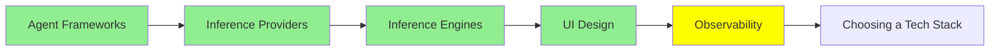

# Observability (Gözlemlenebilirlik)

*(Bu bir placeholder modül — şimdilik kısa bir özet; tam ders içeriği yakında geliyor.)*

Agent'larının gerçekte ne yaptığını izlemek—yol boyunca her prompt, tool çağrısı ve karar.

**Bu modülde işlenecek konular**:
- LangSmith
- LangFuse
- Trace-analyzer agent'lar

## Eğitim İlerlemesi

