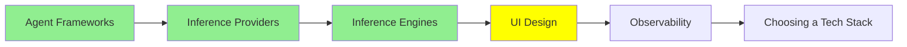

# UI Design

*(Placeholder module — a short overview for now; full lesson content is coming soon.)*

Tools and practices for designing agent-facing or agent-built interfaces.

**Topics this module will cover**:
- Stitch
- Claude's design tooling
- Design Systems
- DESIGN.md

## Tutorial Progress

