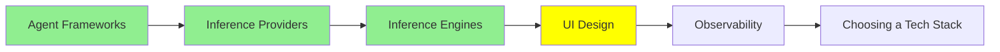

# UI Design

An agent that writes code will happily write you an interface. The problem is that it writes a different one every time.

Ask for a settings page today and a dashboard tomorrow and you get two screens that plainly came from two different products: different blues, different corner radius, different button heights, different idea of what a heading weighs. Each one looks fine alone. Together they look like nobody was in charge.

This module is about the two tools that generate interfaces properly, and about the fix for that problem, which turns out to be the same trick as [Coding Agents: Extending Them](../2_intermediate/coding_agents.md).

## Two tools that turn a description into a screen

**[Google Stitch](https://stitch.withgoogle.com/)** takes a prompt, an image, a rough sketch or a spoken description and produces a high-fidelity interface plus the HTML and CSS behind it. It came out of Google Labs at I/O 2025, runs on Gemini, and the part designers care about is the export: one click sends the whole thing into Figma with the layout, components and structure intact. So it fits either side of the handoff, whether you want a picture to argue about or markup to build on.

**[Claude Design](https://claude.ai/design)** from Anthropic Labs, launched in April 2026, does the same job from the other direction. It produces prototypes, slides, one-pagers and interactive pieces as real HTML, CSS and JavaScript. Two things make it interesting. It can take an existing **codebase** as the input, work out the design system already in there, and apply it to whatever you asked for next. And it hands off directly to Claude Code, which closes the gap between a prototype and the actual repository.

Between them the pattern is clear enough: describing a screen is now faster than drawing one, and the output is code rather than a picture of code.

## A design system, and why the agent needs it in a file

A **design system** is the set of decisions you make once so you stop remaking them: your colours and what each is for, the type scale, the spacing steps, the corner radius, how a button looks in each of its states. Design teams have kept these for years. What changed is who else needs to read them.

An agent generating a screen has to make every one of those decisions on the spot, and it has no way to know yours. So it invents plausible ones, and the answer is different on Tuesday. Telling it in the prompt works for one screen and does not survive the second.

The fix is the same one that worked for instructions. Write the decisions down in a file, in the repository, and let the agent read it.

## DESIGN.md

`DESIGN.md` is that file, a convention that came out of Stitch and now works with any agent that reads project instructions. Repository root, that exact name, and most agents find it on their own.

It holds two kinds of content, and it needs both:

- **The tokens**, which are exact values. The hex codes, the type scale, the spacing steps, the radii, the component states.
- **The intent**, in words. What the design is trying to feel like, what it deliberately avoids, why the accent colour is used sparingly. This is the part a token list cannot carry, and it is what stops an agent applying your palette to a layout you would never ship.

The demonstration is worth knowing because it is so blunt. Take one prompt, add a `DESIGN.md` modelled on Stripe, and you get Stripe's palette and spacing. Swap in a different brand's file, change nothing else, and the output changes to match. [awesome-design-md](https://github.com/VoltAgent/awesome-design-md) collects community files for popular brands, so the fastest way to see it is to drop one in and re-run a prompt you have already run.

Notice where we have arrived. `AGENTS.md` holds the rules for working in the repository, `SOUL.md` in [Personal Agents](../2_intermediate/personal_agents.md) holds who an agent is, and `DESIGN.md` holds what the product looks like. Same format, same location, same reason: markdown sits exactly where a human can comfortably write it and a model can reliably parse it, and because it lives in the repository it gets versioned and reviewed like anything else.

## What they still do not do

Worth being straight about, because the demos are persuasive.

These tools give you a plausible screen fast. They do not give you the thing a designer gives you, which is knowing what the screen is for: what the user is trying to finish, what should be hard to do by accident, what to leave out. Generate the third-best layout instantly and you can still be solving the wrong problem instantly.

Accessibility is the concrete version of that. Contrast that fails at the ratio, focus states dropped, a control that only works with a mouse, an icon button with no name for a screen reader. A generated interface is frequently wrong in these ways, and none of them show up in a screenshot. Check them yourself.

## Where this fits in the series

## Summary

An agent will write you an interface, and left alone it writes a different one every time, because it has to invent your design decisions on the spot.

Google Stitch turns a prompt, an image or a sketch into a high-fidelity screen with HTML and CSS, and exports the whole thing into Figma. Claude Design produces real HTML, CSS and JavaScript, can read the design system out of an existing codebase, and hands off to Claude Code.

The fix for the inconsistency is `DESIGN.md`: your tokens and your intent, in markdown, at the repository root, where the agent finds it. The demonstration is that swapping one brand's file for another changes the output and nothing else does. It is the same move as `AGENTS.md` and `SOUL.md`, for the same reason.

What none of it gives you is judgement about what the screen is for, or an accessible result. Generated interfaces routinely fail on contrast, focus and keyboard access, and a screenshot will not tell you.

**Quick Check**: you put your palette in the prompt and the second screen still looks wrong. What does `DESIGN.md` hold that a prompt does not?

## References

- [Google Stitch](https://stitch.withgoogle.com/): prompt, image or sketch to a real interface, with a one-click Figma export
- [From idea to app: Introducing Stitch](https://developers.googleblog.com/stitch-a-new-way-to-design-uis/): Google's own announcement, and where the DESIGN.md convention comes from
- [Claude Design](https://claude.ai/design): prototypes as real code, able to read the design system out of a codebase
- [awesome-design-md](https://github.com/VoltAgent/awesome-design-md): ready-made DESIGN.md files for well-known brands, so you can see the effect in one run
