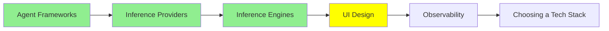

# UI Design

Kod yazan bir agent sana bir arayüz de yazar. Problem, her seferinde farklı bir tane yazması.

Bugün bir ayarlar sayfası, yarın bir dashboard iste, ve açıkça iki farklı üründen gelmiş iki ekran alıyorsun: farklı maviler, farklı köşe yuvarlaklığı, farklı buton yüksekliği, bir başlığın ne kadar kalın olduğu konusunda farklı bir fikir. Her biri tek başına iyi görünüyor. Birlikte, kimsenin başında olmadığı gibi görünüyor.

Bu modül arayüzü düzgün üreten iki tool'la, ve o problemin çözümüyle ilgili; ki çözüm de [Coding Agent'lar: Genişletme](../2_intermediate/coding_agents_tr.md)'deki aynı hile çıkıyor.

## Bir açıklamayı ekrana çeviren iki tool

**[Google Stitch](https://stitch.withgoogle.com/)** bir prompt, bir görüntü, kaba bir karalama ya da sesli bir açıklama alıyor ve yüksek doğrulukta bir arayüz artı arkasındaki HTML ile CSS'i üretiyor. I/O 2025'te Google Labs'tan çıktı, Gemini üzerinde çalışıyor, ve tasarımcıların önemsediği kısım export: tek tıkla bütün şeyi Figma'ya, layout'u, component'leri ve yapısı bozulmadan gönderiyor. Yani devir teslimin her iki tarafına oturuyor; tartışacak bir resim mi istiyorsun yoksa üzerine kuracak markup mu.

Anthropic Labs'ın Nisan 2026'da çıkan **[Claude Design](https://claude.ai/design)** ürünü aynı işi öbür yönden yapıyor. Prototipleri, slaytları, tek sayfalıkları ve etkileşimli parçaları gerçek HTML, CSS ve JavaScript olarak üretiyor. İki şey onu ilginç yapıyor. Input olarak mevcut bir **codebase**'i alabiliyor, içindeki design system'i çıkarabiliyor, ve sonra istediğin şeye uygulayabiliyor. Ve doğrudan Claude Code'a devrediyor, ki bu da bir prototiple gerçek repo arasındaki boşluğu kapatıyor.

Aralarındaki desen yeterince net: bir ekranı anlatmak artık çizmekten hızlı, ve çıktı kodun resmi değil kodun kendisi.

## Bir design system, ve agent'ın onu neden bir dosyada istediği

Bir **design system**, bir kez verdiğin ve böylece yeniden vermeyi bıraktığın kararlar kümesi: renkleriniz ve her birinin ne için olduğu, tipografi ölçeği, boşluk adımları, köşe yuvarlaklığı, bir butonun her durumunda nasıl göründüğü. Tasarım ekipleri bunları yıllardır tutuyor. Değişen şey, onları başka kimin okuması gerektiği.

Bir ekran üreten agent o kararların her birini anında vermek zorunda, ve senin kararlarını bilmesinin hiçbir yolu yok. Yani inandırıcı olanlar uyduruyor, ve cevap salı günü farklı oluyor. Prompt'ta söylemek tek ekran için işe yarıyor ve ikinciden sağ çıkmıyor.

Çözüm, talimatlarda işe yarayanın aynısı. Kararları bir dosyaya, repo'nun içine yaz, ve agent'ın okumasına izin ver.

## DESIGN.md

`DESIGN.md` o dosya; Stitch'ten çıkan ve artık proje talimatlarını okuyan her agent'la çalışan bir konvansiyon. Repo kökü, tam olarak o isim, ve çoğu agent onu kendi başına buluyor.

İki tür içerik tutuyor, ve ikisine de ihtiyacı var:

- **Token'lar**, yani tam değerler. Hex kodları, tipografi ölçeği, boşluk adımları, yuvarlaklıklar, component durumları.
- **Niyet**, kelimelerle. Tasarımın neye benzemeye çalıştığı, bilerek neden kaçındığı, accent renginin neden az kullanıldığı. Bu, bir token listesinin taşıyamayacağı kısım, ve bir agent'ın senin paletini asla göndermeyeceğin bir layout'a uygulamasını engelleyen şey.

Gösterim bilinmeye değer çünkü çok açık. Tek bir prompt al, Stripe'a göre modellenmiş bir `DESIGN.md` ekle, ve Stripe'ın paletini ve boşluklarını alıyorsun. Başka bir markanın dosyasını koy, başka hiçbir şeyi değiştirme, ve çıktı ona uyacak şekilde değişiyor. [awesome-design-md](https://github.com/VoltAgent/awesome-design-md) popüler markalar için topluluk dosyaları topluyor, yani bunu görmenin en hızlı yolu bir tanesini içine atıp daha önce çalıştırdığın bir prompt'u tekrar çalıştırmak.

Nereye vardığımıza dikkat et. `AGENTS.md` repo'da çalışmanın kurallarını tutuyor, [Personal Agent'lar](../2_intermediate/personal_agents_tr.md)'daki `SOUL.md` bir agent'ın kim olduğunu tutuyor, ve `DESIGN.md` ürünün neye benzediğini tutuyor. Aynı format, aynı yer, aynı sebep: markdown tam olarak bir insanın rahatça yazabildiği ve bir modelin güvenilir biçimde ayrıştırdığı yerde duruyor, ve repo'da yaşadığı için diğer her şey gibi versiyonlanıp review ediliyor.

## Hâlâ yapmadıkları

Dürüst olmaya değer, çünkü demolar ikna edici.

Bu tool'lar sana hızlıca inandırıcı bir ekran veriyor. Bir tasarımcının verdiği şeyi vermiyorlar, ki o da ekranın ne için olduğunu bilmek: kullanıcının neyi bitirmeye çalıştığı, kazara yapılması zor olması gereken şey, neyin dışarıda bırakılacağı. Üçüncü en iyi layout'u anında üret, ve hâlâ yanlış problemi anında çözüyor olabilirsin.

Erişilebilirlik bunun somut versiyonu. Orandan geçmeyen kontrast, düşürülmüş focus durumları, sadece fareyle çalışan bir kontrol, ekran okuyucu için adı olmayan bir ikon butonu. Üretilen bir arayüz sık sık bu şekillerde yanlış oluyor, ve hiçbiri bir ekran görüntüsünde görünmüyor. Kendin kontrol et.

## Bu serinin neresindeyiz

## Özet

Bir agent sana bir arayüz yazar, ve kendi hâline bırakılırsa her seferinde farklı bir tane yazar, çünkü senin tasarım kararlarını anında uydurmak zorunda.

Google Stitch bir prompt'u, görüntüyü ya da karalamayı HTML ve CSS'i olan yüksek doğruluklu bir ekrana çeviriyor, ve bütün şeyi Figma'ya export ediyor. Claude Design gerçek HTML, CSS ve JavaScript üretiyor, mevcut bir codebase'ten design system'i okuyabiliyor, ve Claude Code'a devrediyor.

Tutarsızlığın çözümü `DESIGN.md`: token'ların ve niyetin, markdown olarak, repo kökünde, agent'ın bulduğu yerde. Gösterimi şu: bir markanın dosyasını başkasıyla değiştirmek çıktıyı değiştiriyor ve başka hiçbir şey değiştirmiyor. `AGENTS.md` ile `SOUL.md`'nin aynı hamlesi, aynı sebeple.

Hiçbirinin sana vermediği şey, ekranın ne için olduğuna dair yargı, ya da erişilebilir bir sonuç. Üretilen arayüzler rutin olarak kontrast, focus ve klavye erişiminde başarısız oluyor, ve bir ekran görüntüsü bunu sana söylemiyor.

**Hızlı Kontrol**: paletini prompt'a koydun ve ikinci ekran hâlâ yanlış görünüyor. `DESIGN.md` bir prompt'un tutmadığı neyi tutuyor?

## Kaynaklar

- [Google Stitch](https://stitch.withgoogle.com/): prompt, görüntü ya da karalamadan gerçek bir arayüze, tek tıkla Figma export'uyla
- [From idea to app: Introducing Stitch](https://developers.googleblog.com/stitch-a-new-way-to-design-uis/): Google'ın kendi duyurusu, ve DESIGN.md konvansiyonunun çıktığı yer
- [Claude Design](https://claude.ai/design): gerçek kod olarak prototipler, bir codebase'ten design system'i okuyabiliyor
- [awesome-design-md](https://github.com/VoltAgent/awesome-design-md): bilinen markalar için hazır DESIGN.md dosyaları, etkiyi tek çalıştırmada görebilmen için
