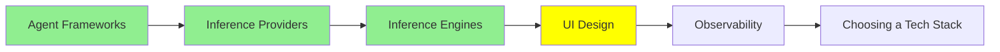

# UI Tasarımı

*(Bu bir placeholder modül — şimdilik kısa bir özet; tam ders içeriği yakında geliyor.)*

Agent'a yönelik veya agent tarafından inşa edilen arayüzleri tasarlama araçları ve pratikleri.

**Bu modülde işlenecek konular**:
- Stitch
- Claude'un tasarım araçları
- Design System'ler
- DESIGN.md

## Eğitim İlerlemesi

