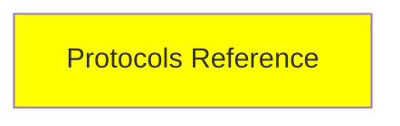

# Protocols Reference

*(Placeholder module — a short overview for now; full lesson content is coming soon.)*

A single reference page collecting every protocol mentioned across the series (MCP, A2A, ACP, AG-UI, and more), plus a few extra ones worth knowing.

**Topics this module will cover**:
- Every protocol mentioned in this series
- NLWeb
- UCP
- AP2

## Tutorial Progress

