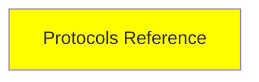

# Protokol Referansı

*(Bu bir placeholder modül — şimdilik kısa bir özet; tam ders içeriği yakında geliyor.)*

Seri boyunca bahsedilen tüm protokolleri (MCP, A2A, ACP, AG-UI ve daha fazlası) tek bir sayfada toplayan, ve bilinmeye değer birkaç ekstra protokolü de ekleyen bir referans.

**Bu modülde işlenecek konular**:
- Bu seride bahsedilen her protokol
- NLWeb
- UCP
- AP2

## Eğitim İlerlemesi

