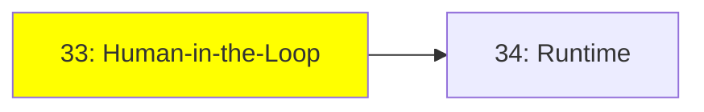

# Module 33: Human-in-the-Loop

*Kategori: Optional — Modül 33 (bu kategoride 1/2)*

*(Bu bir placeholder modül — şimdilik kısa bir özet; tam ders içeriği yakında geliyor.)*

Çalışan bir agent'ı tamamen otonom bırakmak yerine, kontrolünü bir insanda tutmak.

**Bu modülde işlenecek konular**:
- Interrupt
- Steering

## Eğitim İlerlemesi

**Önceki Modül:** [Protocols & Specs — Modül 32: Protokol Referansı](../5_protocols_specs/32_protocols_reference_tr.md)
**Sonraki Modül:** [Modül 34: Runtime](34_runtime_tr.md)
