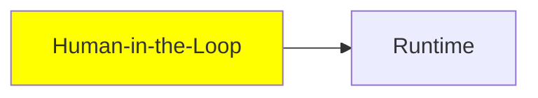

# Human in the Loop

*(Placeholder module — a short overview for now; full lesson content is coming soon.)*

Keeping a human in control of a running agent instead of letting it run fully autonomously.

**Topics this module will cover**:
- Interrupt
- Steering

## Tutorial Progress

