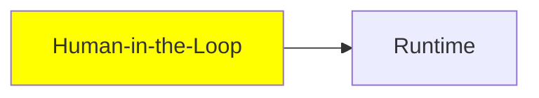

# Human-in-the-Loop

*(Bu bir placeholder modül — şimdilik kısa bir özet; tam ders içeriği yakında geliyor.)*

Çalışan bir agent'ı tamamen otonom bırakmak yerine, kontrolünü bir insanda tutmak.

**Bu modülde işlenecek konular**:
- Interrupt
- Steering

## Eğitim İlerlemesi

