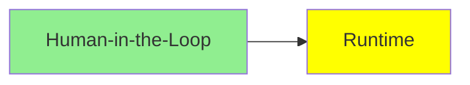

# Runtime

*(Placeholder module — a short overview for now; full lesson content is coming soon.)*

The infrastructure question of running agents reliably over long, failure-prone tasks.

**Topics this module will cover**:
- Checkpoints
- Fault Tolerance
- Time Travel

## Tutorial Progress

