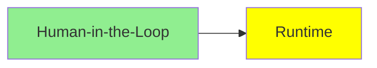

# Runtime

*(Bu bir placeholder modül — şimdilik kısa bir özet; tam ders içeriği yakında geliyor.)*

Agent'ları uzun ve hataya açık görevler boyunca güvenilir şekilde çalıştırma altyapısı sorunu.

**Bu modülde işlenecek konular**:
- Checkpoints
- Fault Tolerance
- Time Travel

## Eğitim İlerlemesi

