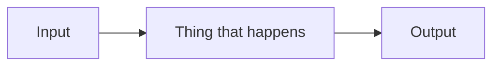
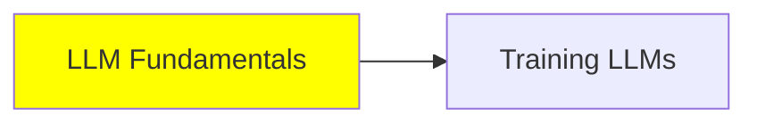

---
# ---------------------------------------------------------------------------
# The two fields a module file still declares. Everything else about a module
# (its name, its title, its status, its minutes, its prerequisites, and its
# NUMBER, which is its position) lives in `mini-courses/curriculum.yaml`.
#
# A draft has neither of these, so a draft has no frontmatter block at all:
# delete this whole fence, opening `---` and closing `---` included.
#
# Adding a field back that the config owns FAILS THE BUILD, naming the field.
# That is the point: two places to write down one fact is what the config
# removed.
# ---------------------------------------------------------------------------

# One sentence. Shown on cards and listings, so it says what the reader gets,
# not what the module "covers". Required once the config calls this `ready`.
summary: "One sentence saying what a reader walks away able to do."

# The reader sees these verbatim, next to the button that marks the module done.
# So write them as claims a reader can make about themselves, starting with a
# verb. Two minimum once the config calls this `ready`, five is a comfortable
# maximum.
objectives:
  - "Explain the one idea this module exists to teach"
  - "Describe the thing that trips people up, and why"
---

# Short Module Title

One short paragraph before the first heading. Say why this module exists and what
it connects to. This is the dek: the renderer pulls it out and sets it apart, so
keep it to two or three sentences and do not put a heading above it.

## The first real section

Plain `##` headings only. They become the module's table of contents and its
TOPICS column, so write them as things, not as questions, and keep them short.

Body rules that matter, all from `MANIFEST.md`:

- No em dashes. Use a colon, a comma, parentheses, or two sentences.
- "me" for the author, "we" for the project. Never a bare "I".
- Plain English, short sentences, readable by a non-native speaker.
- Depth is the limit, not length. Cover a lot if you like, but keep every part
  simple and high level.

## Figures

Images are markdown, never raw HTML. Image line, two trailing spaces, then the
caption in italics. The app turns this into a numbered figure with a caption
label, and it strips raw HTML out entirely, so a hand-written `` tag will
not appear on the site.

  
*One or two lines saying something the picture cannot say on its own.*

Diagrams follow the project's one visual system. Templates live in `assets/`,
ready-made prompts in `scratchpad/diagrams/`. Finished images go in
`<category>/images/`.

Mermaid works too, and needs no image at all:



Tables are fine. The renderer classes them by width and makes them scroll, so a
wide one is safe:

| Thing | What it is |
| --- | --- |
| A | the first one |
| B | the second one |

## Code

Always tag the language. The renderer adds the copy button and the theme
variants, and an untagged block fails the build.

```python
def example() -> str:
    return "tagged, so it highlights"
```

## Cross-references

Link other modules with a plain relative markdown path. The app rewrites these
into real routes at build time, and a link it cannot resolve fails the build:

- same category: `[Memory](memory.md)`
- another category: `[Context Engineering](../2_intermediate/context_engineering.md)`

The label is the target's TITLE, never its number: the number is a position and
it moves. And a sentence names a module the same way, so "Memory covers the
message stack", never "Module 5 covers".

## Optional: a self-check

Written as a bold inline run opening a paragraph, never as a heading. The app
finds it, lifts it out of the prose, and shows it as the module's self-check with
somewhere for the reader to answer.

**Quick Check**: one question a reader can answer from this module alone?

## Optional: a checklist

Task items become tickable boxes the reader's own record remembers, keyed by
position. So new items go at the end, or earlier ticks shift onto the wrong item.

- [ ] something the reader does to their own project
- [ ] something they check afterwards

## Summary

If a module has a Quick Check, the app reveals this section as the closest thing
to an answer. There are no written answer keys anywhere in the corpus, and none
should be invented, so this section carries the ground the answer stands on.

## Where this fits in the series

Optional, and duplicated by navigation the app draws itself. Keep it or drop it.



Node labels are titles, not numbers. The rails used to read `[1. LLMs]`, and the
Expert ones had drifted a whole module out of step with the files they named.

## References

Every module ends with links out, built from the links actually used above.
External links are counted as sources the reader can mark as read.

- [Something worth reading](https://example.com): why it is worth reading
- [Something else](https://example.com): and why

<!--
  Three notes on things that are easy to get wrong.

  1. **This file does not end with a prev/next footer, and a module must not
     either.** `**Previous Module:**` and `**Next Module:**` lines are deleted
     from the corpus. The app derives the sequence from `curriculum.yaml` and
     draws the navigation itself, and the hand-written version had already
     drifted: the Intermediate chain read 8, 9, 10, 11, 13, 12, 14. `strip.ts`
     still removes those lines, so one added back would be invisible on the
     site and wrong on GitHub, which is the worst of both.

     The same goes for the italic `*Category: … — Module 11 (4 of 7 …)*` dek
     under the H1, and for the `## Modules` list in a category README.

  2. **The module is not finished until it is in `curriculum.yaml`.** One line,
     in the position it should hold. A file nobody listed fails the build, and a
     name listed with no file fails it too.

  3. The Turkish version is a sibling named `<name>_tr.md`, translated only once
     the English is final. It carries no frontmatter at all, and the app does not
     render Turkish yet, so it is authored and committed but not yet published.
     A module with no Turkish sibling fails the build.
-->
